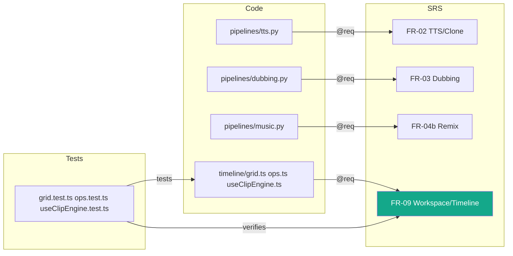

# Appendix D — Traceability Matrix

| Field | Value |
|-------|-------|
| **Version** | 1.4.2b |
| **Status** | Beta |
| **Author** | Boss |
| **Created** | 2026-08-09 |
| **Last Updated** | 2026-09-20 |
| **Approved By** | Boss — Phase 1 scope approved 2026-08-23 |

โยง requirement ([SRS.md](../product/SRS.md)) ↔ design ↔ โค้ด ↔ เทสต์ — แถวไหน Test ว่าง = ช่องโหว่ coverage ที่รู้ตัว

## Functional Requirements

| Req | ชื่อ | Design | Code (หลัก) | Test | สถานะ |
|---|---|---|---|---|---|
| FR-01 | Voice Library | SPEC · BLUEPRINT§views.voices | `app/services/voices.py` + `routers/voices.py` | ✏️ TODO | ✅ done |
| FR-02 | TTS + Voice Cloning | SPEC · BLUEPRINT§models.tts | `app/pipelines/tts.py` + `routers/tts.py` | `smoke_tts.py` (manual) | ✅ done |
| FR-03 | AI Dubbing | SPEC · BLUEPRINT§views.dubbing | `app/pipelines/asr.py`, `dubbing.py` | ✏️ TODO — e2e ยังไม่ได้รัน | ⚠️ รอ e2e |
| FR-04 | Audio Mastering | SPEC · BLUEPRINT§views.mastering | `app/pipelines/mastering.py` | ✏️ TODO | ✅ done |
| FR-04b | Music Remix | ROADMAP_MUSIC · BLUEPRINT§views.remix | `app/pipelines/music.py` + `routers/music.py` | PoC ผ่าน (manual) | backend ✅ / UI กำลังทำ |
| FR-05 | Brain / LLM | SPEC · BLUEPRINT§stack.llm | `app/brain/*` + `routers/brain.py` | ✏️ TODO | ✅ done |
| FR-06 | Job System | SPEC §4 · API_SEMANTICS | `app/jobs/*` + `routers/jobs.py` + `useJob.ts` | `test_job_continuity.py` · `test_gpu_admission.py` · `useJob.test.tsx` | 🟡 automated done / restart manual gate open |
| FR-07 | File Management | SPEC | `routers/files.py`, `fs.py` | ✏️ TODO | ✅ done |
| FR-08 | Auto-Update | SPEC · PACKAGING_SIDECAR | Tauri updater + `.github/workflows/release.yml` | ✏️ TODO — ทดสอบ update จริง | ⚠️ รอ validate |
| FR-09 | Workspace/Timeline | UI_SITEMAP§2-3 · SWARM_PLAN W2.1-2.2/3.2-3.4 | `apps/desktop/src/timeline/*` + ClipTimeline, StudioDock, StemMixer, FxRack | `grid.test.ts` · `ops.test.ts` · `useClipEngine.test.ts` | ✅ done |
| FR-10 | Projects | SWARM_PLAN W0.2/0.6 · A-api-spec (✏️) | `routers/projects.py` + `hooks/useProjectFile.ts` | ✏️ TODO | ✅ done |
| FR-11 | Plugin Manager + Marketplace | SWARM_PLAN W3.6/5.1 · ROADMAP_MUSIC (BYOM) | `routers/plugins.py` + `packs.py`, PluginsPanel, MarketplacePanel | ✏️ TODO | ✅ / packs ยัง mock in-memory |
| FR-12 | Mic Recording | SWARM_PLAN W3.1 | `MicRecorder.tsx` + ปุ่มอัดใน ClipTimeline | ✏️ TODO | ✅ / FR-12.6 (ref voice) ยังไม่ทำ |
| FR-13 | Batch Queue | SWARM_PLAN W3.5 · SPEC §4 | `useBatchQueue.ts` + `BatchQueue.tsx` | `useBatchQueue.test.tsx` | ✅ persist/re-attach/interrupted/queued |
| FR-14 | Workspace Agent + Mix Copilot | ai-system/agent-architecture (AI-AGT-001) · SWARM_PLAN W4.1-4.3 | `routers/agent.py` + `MixCopilot.tsx` | ✏️ TODO | ✅ done |
| FR-15 | File Manager | UI_SITEMAP§3 (files) | `routers/fs.py` + `FileManager.tsx` | ✏️ TODO | ✅ done |
| FR-19 (candidate, CR-005) | Headless Voice Worker (PRP supplier) | ADR-005 · API_SEMANTICS §voice_worker · BLUEPRINT§api (voice-worker) | `app/voice_worker/*` (แยกจาก `app.main`; stub + faster-whisper engines; `profiles/voice-worker/asr-th-en-01*.json`) | `tests/voice_worker/*` (105 ใน speech venv / 85+1 skip ใน venv หลัก) · `tools/verify/smoke_voice_worker_control.ps1 -Manifest` | 🟡 Slice A stub + Slice B ASR (turbo เท่านั้น, cuda int8_float16, VAD on — D8/D14 applied) ผ่านในเครื่อง 5060 Ti / Thai quality, RTX 3060, joint PRP = NOT_RUN; TTS BLOCKED (D9) |

## Lalin Play — separate Studio baseline and standalone evidence

The existing functional table and concurrent voice-worker row above remain
unchanged. This manually maintained mapping is not generated doc-graph output.
The isolated Play review branch (`codex/lalin-play-review`, merged to `main` as
PR #19) did not include the voice-worker changes; this shared branch carries both.

| Requirement | Design owner | Code | Tests / status |
|---|---|---|---|
| FR-16 / FR-16W | CR-001; approved Studio command-delivery plan | `apps/desktop/src/playback`, `LalinPlayWindow.tsx` | Historical Studio reports only; not standalone IPC/release proof |
| FR-17 | Playback EQ baseline; ADR-004 owner retention | Studio EQ and separate candidate `apps/play-desktop/src/playback` | Standalone EQ suite mapped in Play matrix; physical device coverage partial |
| FR-18 | CR-002, TV Mode architecture/design | Studio TV adapters; separate standalone candidate adapter | Historical Studio native evidence + standalone input mocks; native standalone gamepad not qualified |
| PLAY-01–10 | PRD §4.9 / ADR-004 | `apps/play-desktop`; integration/import/release missing | Per-criterion partial/not-implemented status in linked matrix |
| PLAY-V01–10 | CR-003 local video | Candidate VideoStage/media owner/native catalog | App/Rust tests + video snapshots; physical A/V limits |
| PLAY-C01–13 | CR-004 including Addendum A | Candidate CompactTransport/preview/fullscreen/relativeSeek | 48 frontend/7 Rust suite and native evidence with device gaps |

Canonical row-level mapping: [LALIN_PLAY_TRACEABILITY](../validation/LALIN_PLAY_TRACEABILITY.md).
Current publication/status: [Play documentation register](../product/LALIN_PLAY_DOCUMENTATION.md).
Do not treat the old scan counts below as coverage of these 33 standalone criteria.

## Non-Functional Requirements

| Req | ชื่อ | ตรวจด้วย | สถานะ |
|---|---|---|---|
| NFR-01 | ประสิทธิภาพ | ตัวเลขวัดจริง: TTS ~9s / Ollama warm ~2s — ✏️ TODO เก็บเป็น benchmark ซ้ำได้ | ⚠️ |
| NFR-02 | ความเชื่อถือได้ | lazy import + CPU fallback + durable jobs + GPU FIFO: `test_runtime_devices.py`, `test_job_continuity.py`, `test_gpu_admission.py` | 🟡 automated green / CPU-TTS + RTX3060 manual gates open |
| NFR-03 | ความปลอดภัย | API key masked · keys/ gitignored · ✏️ TODO ทบทวน SEC-xxx เป็นรายการ | ⚠️ |
| NFR-04 | ความสามารถในการใช้งาน | UI ไทย + JobProgress ทุกงานยาว | ✅ |
| NFR-05 | Portability | Windows x64 เท่านั้น (v0.1 by design) | ✅ |
| NFR-06 | Maintainability | brain provider ผ่าน interface เดียว · docs ชุดนี้ | ✅ |

## ช่องโหว่ที่เห็นจาก matrix

1. **เทสต์อัตโนมัติฝั่ง backend มีแล้ว 63 ตัว** (PR #9) แต่ยังกระจุกที่ `render/bundle/agent/files` — pipeline หลัก (tts/dubbing/mastering/music) ยังพึ่ง manual/PoC smoke script ไม่ใช่ pytest จริง
2. Dubbing e2e (FR-03) + Auto-update (FR-08) ยังไม่เคย validate จริง — ตรงกับสถานะใน README/PACKAGING_SIDECAR
3. FR-09 (timeline) + FR-07 (files) + FR-10 (projects) + FR-14 (agent) มีเทสต์แล้ว — `plugins`/`packs`/`fs` routers ยังไม่มีเทสต์เลย

## ผลสแกน doc-graph (อัตโนมัติ)

> สแกนล่าสุด 2026-08-19 (หลัง PR #9 ย้ายเข้า `apps/`) โดย `tools/doc_graph_scan.py` — รันซ้ำ: `apps/api/.venv/Scripts/python.exe tools/doc_graph_scan.py` (fallback `backend/.venv` ถ้ายังไม่ย้าย)

| Metric | ค่า | เป้า |
|---|---|---|
| Requirements ↔ code (annotation `@req` จริงในโค้ด) | **69% (25/36)** | 50%+ ✅ |
| Requirements ↔ tests (verifies) | **13% (5/36)** — PR #9 เพิ่ม FR-07 (upload), FR-10 (projects/bundle), FR-14 (agent) เข้ามา | 90% |
| Code files ที่เอกสารอ้างถึง | 1% (1/85) | 80% |
| Code files ที่มีเทสต์ | **8% (7/85)** — apps/api/tests/ 8 ไฟล์ (63 เทสต์) + apps/desktop 8 ไฟล์ (111 เทสต์) นับตาม pairing ชื่อไฟล์ ไม่ใช่ % ของ pipeline โค้ดจริง — pipelines (tts/dubbing/mastering/music) ยังมีแต่ smoke script | — |
| endpoints ที่สแกนพบ vs BLUEPRINT.yaml | 45 พบ, 45 มีใน blueprint, **0 ขาด** (ปิดแล้ว 2026-08-19 — เพิ่ม /render, /projects/{pid}/bundle, /projects/import) | 0 ขาด |

**หมายเหตุ:** annotation migration **เสร็จแล้ว** (2026-08-09) — `@req/@spec` ครบ 44 ไฟล์ (backend 26 + frontend 18, รวม 55 จุด) ครอบคลุม FR-01..15 ทุกตัว → matrix นี้ตรวจ drift อัตโนมัติได้ตั้งแต่รอบนี้ · verifies ไม่ต้องใช้ `@tested`: scanner โยง test → code (คู่ชื่อไฟล์) → requirement ให้อัตโนมัติ (ตอนนี้ได้ 5/36 (FR-07, FR-09, FR-10, FR-14 และอีก 1 ตัว — ดูตาราง Requirements ↔ tests ด้านบน) — mermaid ด้านล่างวาดไว้ตอน FR-09 ตัวเดียว ยังไม่ได้อัปเดตตามรอบสแกนนี้) · 14 requirements ที่ไม่มี implements เป็นเชิงนโยบาย/เอกสาร (NFR-01/03/04, AI-AGT-002..005, AI-ETH-001/002/004, BR-001, DR-xxx) — ปกติสำหรับ requirement ประเภทนี้

### Reverse gap — โค้ดมีแล้วแต่ "ไม่มี requirement" (✅ ปิดแล้ว 2026-08-09)

สแกนพบ **26 components + 21 endpoints** จาก Wave 2-5 ที่ SRS ยังไม่มี FR รองรับ — **เขียนเป็น FR-09..FR-15 ใน [SRS v1.1.0](../product/SRS.md) แล้ว** (แถว traceability อยู่ในตารางหลักข้างบน):

| FR | ฟีเจอร์ | โค้ดที่มีแล้ว |
|---|---|---|
| FR-09 | Workspace/Timeline (DAW floor + clips) | `apps/desktop/src/timeline/*` (**มีเทสต์แล้ว 3 ไฟล์**), Timeline, ClipTimeline, StudioDock, StemMixer, FxRack |
| FR-10 | Projects | `routers/projects.py` (5 endpoints), useProjectFile.ts |
| FR-11 | Plugin Manager + Marketplace + Packs | `routers/plugins.py` + `packs.py` (5 endpoints), PluginsPanel, MarketplacePanel |
| FR-12 | Mic Recording | MicRecorder.tsx |
| FR-13 | Batch Queue | useBatchQueue.ts, BatchQueue.tsx |
| FR-14 | Workspace Agent + Mix Copilot | `routers/agent.py` (`POST /agent/act`), MixCopilot.tsx — ผูกกับ AI-AGT-001 |
| FR-15 | File Manager | `routers/fs.py` (6 endpoints), FileManager.tsx |

### แผนภาพ (ตัดเฉพาะแกนหลัก)

ทุกเส้น = ตรวจพบจากสแกนจริง (annotation `@req` ในโค้ด · test คู่ชื่อไฟล์ · verifies ที่ scanner โยงให้)

## Version History

| Version | Date | Author | Changes |
|---------|------|--------|---------|
| 1.0.0 | 2026-08-09 | Boss | สร้างผ่าน rwang:doc-architect |
| 1.1.0 | 2026-08-09 | Boss | เพิ่มผลสแกน doc-graph + reverse gap (FR-09..15 เสนอ) + mermaid |
| 1.2.0 | 2026-08-09 | Boss | ปิด reverse gap (FR-09..15 เข้า SRS v1.1.0 + แถวในตาราง FR) · annotation `@req` ลงโค้ด 44 ไฟล์ → coverage 61%, verifies FR-09 |
| 1.3.0 | 2026-08-19 | Boss | สแกนใหม่หลัง PR #9 (monorepo migration เข้า apps/) — path ref backend/frontend -> apps/api/apps/desktop, coverage 61%->69% @req / 2%->13% verifies / 3%->8% files-with-tests, endpoint scan 45 (3 ขาดจาก BLUEPRINT.yaml) |
| 1.3.1b | 2026-08-23 | LALIN | เพิ่ม automated evidence ของ G-09/G-06/G-07 และแยก manual CPU/RTX/clean-VM gates ที่ยังเปิด |
| 1.4.0b | 2026-09-20 | LALIN | Link standalone Play requirements/evidence separately from historical Studio and preserve concurrent worker mapping |
| 1.4.1b | 2026-09-20 | LALIN | Clarify that the isolated Play review branch excludes concurrent voice-worker work |
| 1.4.2b | 2026-09-20 | LALIN | Merge `main` (PR #19) into the shared branch that carries the FR-19 voice-worker row; both histories retained |
| 1.4.3b | 2026-09-21 | LALIN | FR-19 row: Slice B ASR (faster-whisper engine, asr-th-en-01 manifests) evidence linked; Thai/3060/joint still NOT_RUN |

## CHANGELOG

Frontmatter timestamps record metadata introduction; original document creation
date and historical scan sections remain unchanged.

| Version | Date | Status | Summary | Commit Hash | Agent |
|---|---|---|---|---|---|
| 1.4.4b | 2026-09-21 | beta | FR-19 row: D8 (single turbo profile) and D14 (VAD on) applied | based on 877a121 | LALIN |
| 1.4.3b | 2026-09-21 | beta | Update FR-19 row with Slice B ASR engine/manifests/tests | based on 7d6235d | LALIN |
| 1.4.2b | 2026-09-20 | beta | Resolve merge of main (PR #19, 8a36a60) into codex/lalin-play-split; keep FR-19 voice-worker row and Play sections from both sides | merge of 8a36a60 | LALIN |
| 1.4.1b | 2026-09-20 | beta | Clarify isolated review scope without introducing unrelated worker changes | based on 2e1eb73 | LALIN |
| 1.4.0b | 2026-09-20 | beta | Add Play ownership/traceability links and version metadata; preserve prior content | based on f5a6681 | LALIN |
