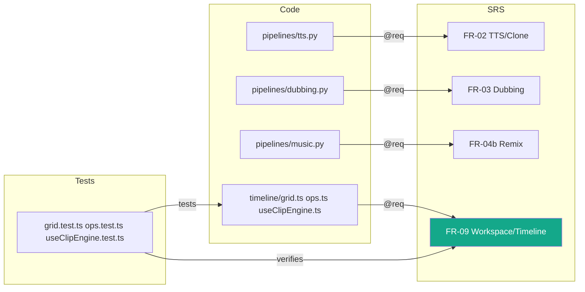

# Appendix D — Traceability Matrix

| Field | Value |
|-------|-------|
| **Version** | 1.2.0 |
| **Status** | Draft |
| **Author** | Boss |
| **Created** | 2026-08-09 |
| **Last Updated** | 2026-08-09 |
| **Approved By** | — |

โยง requirement ([SRS.md](../SRS.md)) ↔ design ↔ โค้ด ↔ เทสต์ — แถวไหน Test ว่าง = ช่องโหว่ coverage ที่รู้ตัว

## Functional Requirements

| Req | ชื่อ | Design | Code (หลัก) | Test | สถานะ |
|---|---|---|---|---|---|
| FR-01 | Voice Library | SPEC · BLUEPRINT§views.voices | `app/services/voices.py` + `routers/voices.py` | ✏️ TODO | ✅ done |
| FR-02 | TTS + Voice Cloning | SPEC · BLUEPRINT§models.tts | `app/pipelines/tts.py` + `routers/tts.py` | `smoke_tts.py` (manual) | ✅ done |
| FR-03 | AI Dubbing | SPEC · BLUEPRINT§views.dubbing | `app/pipelines/asr.py`, `dubbing.py` | ✏️ TODO — e2e ยังไม่ได้รัน | ⚠️ รอ e2e |
| FR-04 | Audio Mastering | SPEC · BLUEPRINT§views.mastering | `app/pipelines/mastering.py` | ✏️ TODO | ✅ done |
| FR-04b | Music Remix | ROADMAP_MUSIC · BLUEPRINT§views.remix | `app/pipelines/music.py` + `routers/music.py` | PoC ผ่าน (manual) | backend ✅ / UI กำลังทำ |
| FR-05 | Brain / LLM | SPEC · BLUEPRINT§stack.llm | `app/brain/*` + `routers/brain.py` | ✏️ TODO | ✅ done |
| FR-06 | Job System | SPEC | `app/jobs/*` + `routers/jobs.py` | ✏️ TODO | ✅ done |
| FR-07 | File Management | SPEC | `routers/files.py`, `fs.py` | ✏️ TODO | ✅ done |
| FR-08 | Auto-Update | SPEC · PACKAGING_SIDECAR | Tauri updater + `.github/workflows/release.yml` | ✏️ TODO — ทดสอบ update จริง | ⚠️ รอ validate |
| FR-09 | Workspace/Timeline | UI_SITEMAP§2-3 · SWARM_PLAN W2.1-2.2/3.2-3.4 | `frontend/src/timeline/*` + ClipTimeline, StudioDock, StemMixer, FxRack | `grid.test.ts` · `ops.test.ts` · `useClipEngine.test.ts` | ✅ done |
| FR-10 | Projects | SWARM_PLAN W0.2/0.6 · A-api-spec (✏️) | `routers/projects.py` + `hooks/useProjectFile.ts` | ✏️ TODO | ✅ done |
| FR-11 | Plugin Manager + Marketplace | SWARM_PLAN W3.6/5.1 · ROADMAP_MUSIC (BYOM) | `routers/plugins.py` + `packs.py`, PluginsPanel, MarketplacePanel | ✏️ TODO | ✅ / packs ยัง mock in-memory |
| FR-12 | Mic Recording | SWARM_PLAN W3.1 | `MicRecorder.tsx` + ปุ่มอัดใน ClipTimeline | ✏️ TODO | ✅ / FR-12.6 (ref voice) ยังไม่ทำ |
| FR-13 | Batch Queue | SWARM_PLAN W3.5 | `useBatchQueue.ts` + `BatchQueue.tsx` | ✏️ TODO | ✅ done |
| FR-14 | Workspace Agent + Mix Copilot | ai-system/agent-architecture (AI-AGT-001) · SWARM_PLAN W4.1-4.3 | `routers/agent.py` + `MixCopilot.tsx` | ✏️ TODO | ✅ done |
| FR-15 | File Manager | UI_SITEMAP§3 (files) | `routers/fs.py` + `FileManager.tsx` | ✏️ TODO | ✅ done |

## Non-Functional Requirements

| Req | ชื่อ | ตรวจด้วย | สถานะ |
|---|---|---|---|
| NFR-01 | ประสิทธิภาพ | ตัวเลขวัดจริง: TTS ~9s / Ollama warm ~2s — ✏️ TODO เก็บเป็น benchmark ซ้ำได้ | ⚠️ |
| NFR-02 | ความเชื่อถือได้ | lazy import + error message แนะนำ · timeout 600s | ✅ |
| NFR-03 | ความปลอดภัย | API key masked · keys/ gitignored · ✏️ TODO ทบทวน SEC-xxx เป็นรายการ | ⚠️ |
| NFR-04 | ความสามารถในการใช้งาน | UI ไทย + JobProgress ทุกงานยาว | ✅ |
| NFR-05 | Portability | Windows x64 เท่านั้น (v0.1 by design) | ✅ |
| NFR-06 | Maintainability | brain provider ผ่าน interface เดียว · docs ชุดนี้ | ✅ |

## ช่องโหว่ที่เห็นจาก matrix

1. **เทสต์อัตโนมัติฝั่ง backend แทบไม่มี** — frontend มี vitest แล้ว แต่ pipeline หลักยังพึ่ง manual/PoC
2. Dubbing e2e (FR-03) + Auto-update (FR-08) ยังไม่เคย validate จริง — ตรงกับสถานะใน README/PACKAGING_SIDECAR
3. FR ใหม่ (FR-09..15) มีเทสต์เฉพาะ timeline — routers ใหม่ (`projects/plugins/packs/agent/fs`) ยังไม่มีเทสต์เลย

## ผลสแกน doc-graph (อัตโนมัติ)

> สแกนล่าสุด 2026-08-09 โดย `tools/doc_graph_scan.py` — รันซ้ำ: `backend/.venv/Scripts/python.exe tools/doc_graph_scan.py`

| Metric | ค่า | เป้า |
|---|---|---|
| Requirements ↔ code (annotation `@req` จริงในโค้ด) | **61% (22/36)** | 50%+ ✅ |
| Requirements ↔ tests (verifies) | 2% (1/36) — FR-09 ผ่าน timeline tests | 90% |
| Code files ที่เอกสารอ้างถึง | 2% (2/76) | 80% |
| Code files ที่มีเทสต์ | 3% (3/76) — เฉพาะ timeline | — |

**หมายเหตุ:** annotation migration **เสร็จแล้ว** (2026-08-09) — `@req/@spec` ครบ 44 ไฟล์ (backend 26 + frontend 18, รวม 55 จุด) ครอบคลุม FR-01..15 ทุกตัว → matrix นี้ตรวจ drift อัตโนมัติได้ตั้งแต่รอบนี้ · verifies ไม่ต้องใช้ `@tested`: scanner โยง test → code (คู่ชื่อไฟล์) → requirement ให้อัตโนมัติ (ตอนนี้ได้ FR-09 ตัวเดียว เพราะเทสต์มีแค่ฝั่ง timeline) · 14 requirements ที่ไม่มี implements เป็นเชิงนโยบาย/เอกสาร (NFR-01/03/04, AI-AGT-002..005, AI-ETH-001/002/004, BR-001, DR-xxx) — ปกติสำหรับ requirement ประเภทนี้

### Reverse gap — โค้ดมีแล้วแต่ "ไม่มี requirement" (✅ ปิดแล้ว 2026-08-09)

สแกนพบ **26 components + 21 endpoints** จาก Wave 2-5 ที่ SRS ยังไม่มี FR รองรับ — **เขียนเป็น FR-09..FR-15 ใน [SRS v1.1.0](../SRS.md) แล้ว** (แถว traceability อยู่ในตารางหลักข้างบน):

| FR | ฟีเจอร์ | โค้ดที่มีแล้ว |
|---|---|---|
| FR-09 | Workspace/Timeline (DAW floor + clips) | `frontend/src/timeline/*` (**มีเทสต์แล้ว 3 ไฟล์**), Timeline, ClipTimeline, StudioDock, StemMixer, FxRack |
| FR-10 | Projects | `routers/projects.py` (5 endpoints), useProjectFile.ts |
| FR-11 | Plugin Manager + Marketplace + Packs | `routers/plugins.py` + `packs.py` (5 endpoints), PluginsPanel, MarketplacePanel |
| FR-12 | Mic Recording | MicRecorder.tsx |
| FR-13 | Batch Queue | useBatchQueue.ts, BatchQueue.tsx |
| FR-14 | Workspace Agent + Mix Copilot | `routers/agent.py` (`POST /agent/act`), MixCopilot.tsx — ผูกกับ AI-AGT-001 |
| FR-15 | File Manager | `routers/fs.py` (6 endpoints), FileManager.tsx |

### แผนภาพ (ตัดเฉพาะแกนหลัก)

ทุกเส้น = ตรวจพบจากสแกนจริง (annotation `@req` ในโค้ด · test คู่ชื่อไฟล์ · verifies ที่ scanner โยงให้)

## Version History

| Version | Date | Author | Changes |
|---------|------|--------|---------|
| 1.0.0 | 2026-08-09 | Boss | สร้างผ่าน rwang:doc-architect |
| 1.1.0 | 2026-08-09 | Boss | เพิ่มผลสแกน doc-graph + reverse gap (FR-09..15 เสนอ) + mermaid |
| 1.2.0 | 2026-08-09 | Boss | ปิด reverse gap (FR-09..15 เข้า SRS v1.1.0 + แถวในตาราง FR) · annotation `@req` ลงโค้ด 44 ไฟล์ → coverage 61%, verifies FR-09 |
