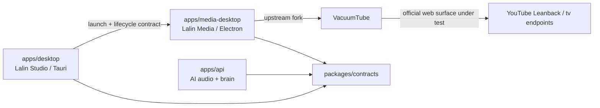

# ADR-001 — Lalin AI Umbrella Platform and Media Boundary

## Decision status

**APPROVED FOR LOCAL P1/P2 IMPLEMENTATION.** ผู้ใช้อนุมัติเอกสารและทิศทาง
umbrella platform วันที่ 2026-09-19 การอนุมัตินี้ครอบคลุมเฉพาะ local fork,
launcher/lifecycle contract และ single-instance behavior; ยังไม่ใช่ production,
packaging หรือ account/pairing acceptance

Complexity: **C-3**. Risk: **HIGH** (หลายแอป, process boundary, account/device
integration และ upstream provenance).

## Context and evidence

- ปัจจุบัน repo มี `apps/desktop` (Tauri + React), `apps/api`, `apps/mcp` และ
  `packages/contracts` เป็นโครงสร้างที่ใช้งานจริง
- `apps/desktop` เป็น Lalin Studio และมี Lalin Play อยู่ใน process/runtime เดียวกัน
  ตาม current repository and sitemap SOT
- TV Mode ปัจจุบันเป็น presentation state ของ Play surface ไม่ใช่ product app ใหม่
- ผู้ใช้ต้องการให้ Lalin AI เป็น umbrella platform ที่แยกงาน Create, Play/Share/
  Control, Room และ Ride โดยไม่เพิ่ม destination เหล่านี้ลงใน Studio rail
- VacuumTube upstream เป็น Electron wrapper ที่โหลด YouTube Leanback surface และมี
  feature ด้าน ad blocking, controller support และ DIAL discoverability; มันเป็น
  unofficial wrapper ไม่ใช่ official YouTube browser และใช้ user-agent behavior
  ของ upstream เพื่อให้ Leanback ทำงาน

## Decision

### 1. Product boundaries

| Name | Role | Runtime status |
|---|---|---|
| **Lalin AI** | umbrella brand/platform | current brand; platform expansion is candidate |
| **Lalin Studio** | local AI audio workstation / Create | current `apps/desktop` |
| **Lalin Media** | media playback, Leanback/TV, share and control application | candidate separate desktop app |
| **Lalin Play** | primary consumer playback experience inside Lalin Media | candidate target; current Play remains interim |
| **Lalin Room** | shared-room/session experience | future candidate; no app/service yet |
| **Lalin Remote** | companion control surface | future candidate; no app yet |
| **Lalin Ride** | mobile/rider experience built on shared media contracts | future candidate; no app yet |
| **Lalin Core** | contracts, device registry, agent actions and shared services | current pieces exist; umbrella extraction is candidate |

Lalin Studio keeps its current eight-item rail. Media, Room, Remote and Ride are
launched as separate surfaces or companion experiences, not as new Studio editor
tabs.

### 2. Process and shell boundary

Keep the current Tauri Studio shell as the creation application. Build the first
Lalin Media vertical slice as a separate Electron runtime based on a pinned
VacuumTube fork. Do not embed an Electron window inside Tauri and do not create a
hybrid shell whose lifecycle, updater and permission model cannot be attributed to
one owner.

The initial boundary is:

The launcher owns only start, focus, close, health and user-visible failure
states. It must not create a second playback engine inside Studio.

### 3. YouTube surface and pairing boundary

The implementation must load the real YouTube surface rather than a cloned local
UI. VacuumTube's documented baseline uses `www.youtube.com/tv` and its pinned
upstream already contains the Leanback user-agent behavior; Lalin does not add a
second identity-spoofing layer. The requested `tv.youtube.com` endpoint is a
separate verification item and must not be silently treated as equivalent.

Authentication and pairing may use only a flow actually exposed by the loaded
official YouTube surface or by a documented upstream device-discovery feature.
Numeric TV-code pairing is **not** assumed to work on a desktop wrapper. DIAL
discoverability is recorded as device discovery, not as proof of TV-code pairing.
If the requested code flow is unavailable, the UI must say unavailable rather than
inventing a pairing success or adding a second identity-spoofing layer.

### 4. Ad filtering boundary

The first Media slice may retain and expose the ad-blocking controls already
provided by the pinned VacuumTube upstream. A custom YouTube-specific network
bypass, DRM circumvention, or injected playback path is outside this ADR and needs
a separate decision, compatibility review and acceptance evidence. “Ad block
enabled” is not evidence that every future YouTube ad format is blocked.

### 5. Shared-core boundary

Share only stable, runtime-neutral contracts first:

- app launch and lifecycle messages;
- media item, queue and now-playing snapshots;
- device discovery and capability facts;
- room/session identifiers when Room is actually scoped;
- AI action intents only after a second consumer exists.

Do not create empty `media-core`, `room-core`, `ride`, `services` or remote
packages solely to match a target tree. Extract a package only when the first
vertical slice has a real second consumer or a contract test that requires it.

## Alternatives rejected

| Alternative | Reason rejected |
|---|---|
| Add YouTube TV/Ride/Room as Studio rail tabs | mixes creation and consumer control; contradicts the current Studio sitemap |
| Port all VacuumTube logic into Tauri immediately | duplicates an existing upstream runtime before WebView2 parity is proven |
| Embed Electron VacuumTube inside Tauri Studio | creates two shell/lifecycle/permission owners in one app |
| Rewrite YouTube Leanback locally | loses official surface behavior and increases maintenance/provenance risk |
| Create the complete future monorepo tree now | speculative structure with no verified consumer or contract |

## Non-goals for this decision

- no code, folder move, workspace change or installer change;
- no claim that `tv.youtube.com` is the same surface as `www.youtube.com/tv`;
- no claim that DIAL provides numeric TV-code pairing;
- no custom YouTube ad-bypass implementation;
- no Room server, signaling service, cloud relay or Ride client;
- no retirement of the current Tauri Play window until Media parity is verified.

## Review gates before implementation

1. Review this ADR, the Media platform plan and the migration map together.
2. Pin and record the exact VacuumTube source/tag/commit and preserve its MIT
   notice in the fork/distribution.
3. Prove the endpoint, authentication/pairing path, controller input and upstream
   ad-block controls in the real Electron runtime.
4. Prove Studio-to-Media lifecycle and single-owner playback behavior.
5. Approve a bounded implementation slice before code is generated.

## Local P1/P2 implementation record

- `apps/media-desktop` now contains the pinned `v1.8.2` source archive and
  [`LALIN_PROVENANCE.md`](../../apps/media-desktop/LALIN_PROVENANCE.md).
- `packages/contracts/src/media.ts` defines the launch/focus/close/status shape.
- Tauri exposes `media_lifecycle`; Studio polls status instead of treating a
  fixed delay as readiness.
- VacuumTube single-instance handling accepts the `--lalin-focus` handoff and
  focuses the existing window.
- Local checks: contracts build, Media syntax check, Studio tests/build and Rust
  check pass. Real endpoint, account/pairing, ad-filter and packaged-app gates
  remain pending.

## Sources

- [VacuumTube README](https://github.com/shy1132/VacuumTube) — upstream wrapper,
  Leanback surface, built-in controls and DIAL description.
- [VacuumTube v1.8.2 release](https://github.com/shy1132/VacuumTube/releases/tag/v1.8.2)
  — initial provenance baseline checked 2026-09-19.
- [VacuumTube MIT license](https://raw.githubusercontent.com/shy1132/VacuumTube/master/LICENSE)
  — distribution/license obligation.
- [VacuumTube package manifest](https://raw.githubusercontent.com/shy1132/VacuumTube/master/package.json)
  — Electron/runtime metadata for the baseline.

## CHANGELOG

| Version | Date | Status | Summary | Commit Hash | Agent |
|---|---|---|---|---|---|
| 0.2.0b | 2026-09-19 | beta | Recorded approved local P1/P2 implementation and upstream Leanback user-agent provenance | uncommitted | LALIN |
| 0.1.0b | 2026-09-19 | candidate | Proposed umbrella platform, separate Media runtime, upstream provenance and pairing/ad-filter boundaries | uncommitted | LALIN |
