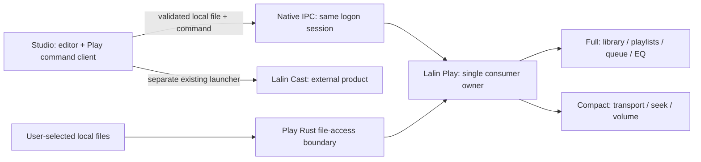

# ADR-004 — Lalin Play standalone product and repository

## 1. Status and decision scope

- Source baseline: `Freshair129/Lalin-AI` at `84290102b84fd76dec069bf6d61ffdd2fc8466ab`.
- Working branch: `codex/lalin-play-split`; no automatic merge into `main`.
- User-approved direction: separate local media player, Full like Spotify/Winamp and Compact like VLC; work on a separate branch.
- The user approved this detailed specification and PRD in the following `approve` turn on 2026-09-20. Implementation is authorized on this branch; approval is not runtime or release evidence.
- Complexity: **C-3** (architecture-driven). Risk: **HIGH** — cross-process commands, file access, data migration and packaging ownership.
- Success: Play works without Studio/API, both surfaces share one owner, Studio handoff works, and current Studio consumers are preserved before extraction/removal.

[ASSUMPTIONS]

1. Windows is the first standalone target; other platforms are not part of this split.
2. Full/Compact are two layouts in one native window, not two simultaneous players.
3. Proposed names are `Freshair129/lalin-play`, `lalin-play.exe`, package `lalin-play`, Rust library `lalin_play_lib`, identifier `ai.lalin.play`. No new remote or installer is claimed to exist.
4. Existing audio-first FR-16/17 was the foundation; approved CR-003 adds bounded local MP4/WebM video display. VLC remains a compact-UI reference, not a promise of VLC codec coverage or a new native decoder.

## 2. Parent and peer alignment

- [Current document/status register](../product/LALIN_PLAY_DOCUMENTATION.md): source `f5a6681` pushed on the Lalin-AI branch; S4 independent export remains NOT_RUN.
- [Integration/migration detail](LALIN_PLAY_INTEGRATION_MIGRATION_SPEC.md), [prepared handoff](LALIN_PLAY_SEPARATION_HANDOFF.md) and [release runbook](../operations/LALIN_PLAY_RELEASE_RUNBOOK.md) elaborate future work as candidates; their new protocol/transaction/release decisions require review before code. They do not supersede this ADR's approved invariants.
- [Standalone traceability](../validation/LALIN_PLAY_TRACEABILITY.md) maps each PLAY requirement to implementation, dated tests and still-open acceptance.
- [PRODUCT](../../PRODUCT.md) and [PRD](../product/PRD.md): Studio creates/edits; Play listens to local media; Cast owns YouTube TV.
- [CR-001](../product/CR-001--LALIN_PLAY_WINDOWS_MEDIA_EQ.md): preserve consumer queue/EQ, audio-first baseline and later video scope.
- [Command delivery plan](LALIN_PLAY_COMMAND_DELIVERY_PLAN.md): one consumer owner, readiness, FIFO, ACK/STATE and explicit unknown-delivery reconciliation remain required.
- [TV Mode plan](LALIN_PLAY_TV_MODE_PLAN.md): retain verified presentation behavior within Full; not a third primary surface and not Cast pairing.
- [Repository SOT](REPOSITORY_ARCHITECTURE_SOT.md) and [sitemap](../design/LALIN_SITEMAP_SOT.md): keep Studio's eight-item rail and editor ownership unchanged.
- [Cast handoff](LALIN_CAST_SEPARATION_HANDOFF.md): Cast stays external; do not import its DIAL, remote WebView, credentials or updater key into Play.

## 3. Current dependency evidence

Paths below are repository-relative at the baseline, not a proposed independent layout.

| Source | Current fact | Consequence for extraction |
|---|---|---|
| `apps/desktop/src/main.tsx`, `src-tauri/tauri.conf.json` | `?surface=play` loads Play in a second window of the Studio binary | A window split is not an independent app/release |
| `apps/desktop/src/playback/audioEngine.ts`, `playbackOwner.ts` | HTML media/Web Audio consumer engine and one Play owner | Reuse the engine first; do not claim Rust-native decoding |
| `apps/desktop/src/playback/playbackBridge.ts` | Same-origin BroadcastChannel, session readiness and command delivery protocol | Replace transport across app identities; retain delivery semantics |
| `apps/desktop/src/playback/windowManager.ts` | Looks up this application's `play` WebviewWindow | Replace Studio launch/focus with an external-app adapter |
| `apps/desktop/src/components/FileManager.tsx`, `LibraryPanel.tsx`, `api.ts` | Media URLs depend on Studio HTTP file endpoints | Resolve actual local files before handoff; localhost URLs do not establish standalone playback |
| `apps/api/app/routers/fs.py` | Workspace file resolution checks canonical containment | Preserve that boundary when adding a narrowly scoped handoff resolver |
| `apps/desktop/src/playback/usePlaybackStore.ts` | Queue/EQ use `lalin:playback:queue` and `lalin:playback:eq` localStorage keys | New app identity needs deliberate migration, not profile deletion |
| `apps/desktop/src/timeline/peaks.ts` | Imports `../playback/audioContext` | Retain/move the Studio-owned audio primitive before deleting Play source |
| `apps/desktop/src/media/mediaLauncher.ts` | Imports `isTauri` from Play `windowManager` | Preserve this helper for the external Cast launcher |
| `packages/contracts/src/playback.ts` | Playback DTOs/EQ constants are shared with Studio | Retain compatibility exports; no broad contracts-package removal |

`LibraryPanel.tsx` also records a mocked pack-download path (TODO G-13).
An unbacked pack ID must produce an unavailable-file result, not an invented disk
path. Completing the pack download feature is outside this extraction.

## 4. Proposed runtime boundary

The Play process owns a Rust + Tauri v2 shell, a locally bundled React UI and the
existing Web Audio playback engine. It must not spawn or require Python, FastAPI,
Ollama or an AI sidecar. Arrange/Mastering preview remains Studio-owned.

### Full and Compact

- Mount the media element, owner/store and media-session adapter once above the layout switch. Switching must not recreate the graph or reload the media URL.
- Full owns local library browsing, real metadata, playlists, queue, Now Playing and EQ. Missing metadata falls back to file names and a neutral cover.
- Compact exposes Play/Pause, ±10 seconds, seek/time, volume/mute, native fullscreen and return to Full; empty state supports open and drag/drop remains. CR-004 and approved Addendum A keep queue/EQ access in Full only, preserving their active state.
- Preserve queue, current track, position, output, volume and EQ across changes. Store independent window bounds and mode; the current 720×480 Play minimum must not prevent Compact sizing.
- Close hides the player with a discoverable tray restore action; explicit Quit stops playback and exits. Studio exit must not kill Play. Repeated launches focus/forward to the same instance.

### Local files and storage

- Read only files/folders deliberately selected in Play or explicitly handed off from Studio. Validate canonical paths at the native boundary; do not enable unrestricted filesystem or remote-page capabilities.
- Use scoped local media serving with seeking/range support. Do not load entire tracks as base64 just to avoid file-serving permissions.
- Folder import indexes selected media and stores file references/metadata; removing a library entry never deletes the source file. No background scan of unrelated disks.
- Persist Play library/playlists/queue/EQ under its own app identity. Validate restored references; missing/moved files remain visible with a relink action. Session resume is opt-in and never auto-plays on startup.

## 5. Studio command and lifecycle contract

Proposed Windows transport: a **named pipe restricted to the same logon session**,
created with an explicit security descriptor/DACL and remote-client rejection.
Do not rely on the default pipe ACL. This needs no LAN discovery or firewall rule.

- Expose only narrow native launch/focus, handoff and snapshot commands to the locally bundled Studio UI. Validate payload schema/version, size, command names and canonical file references in Rust.
- Keep protocol READY/session → COMMAND/id → ACK + STATE, ordered delivery and duplicate suppression. Unknown delivery must be reconciled against the owner; do not blindly replay after ACK loss or into a new owner session.
- Play, Play Next and Add to Queue retain their distinct semantics; Add to Queue must not start playback. Invalid commands/files return actionable errors without clearing the queue.
- The Studio adapter resolves a workspace/upload/output reference to an authorized, persistent local file before sending it. Reuse existing backend path ownership rules; never infer an absolute path from a title, URL or untrusted string concatenation.
- The receiving Play process opens the validated local file itself. Continued playback must survive stopping Studio and its backend; do not forward `http://127.0.0.1:8756/...` as the standalone contract.
- Local same-user IPC is not a defense against arbitrary malicious software already running as that user. It must nevertheless reject remote sessions, malformed data and commands outside the player contract; no shell execution or arbitrary URL forwarding.
- Support an explicit `LALIN_PLAY_EXECUTABLE` development override and a verified installed-app lookup. Missing/unlaunchable Play displays an install/configuration action; never guess a user-specific install directory or silently fall back to a second engine.
- Keep Cast lifecycle configuration unchanged. Do not add Play to Studio's kill-on-exit child process cleanup.

Keep a small versioned wire contract usable by both repositories. Initially copy
only the required DTO/schema definitions with source SHA and parity tests; the
standalone build must not import `F:\lalin` or depend on a parent workspace link.
Do not introduce a new shared package service before a concrete need is proven.

Security references: [Windows named-pipe access control](https://learn.microsoft.com/en-us/windows/win32/ipc/named-pipe-security-and-access-rights)
and [Tauri capabilities](https://v2.tauri.app/security/capabilities/).
These support the proposed boundary, not evidence that it is implemented.

## 6. Existing-data migration and rollback

1. Add explicit export in the old Play/Studio boundary for its existing queue/EQ. Record schema version and source app; only export state that actually exists.
2. Resolve known local file references while the old backend is available. Report unresolved/stale URLs separately; do not export secrets or assume every queue URL maps to disk.
3. Let standalone Play preview/validate and import the selected file. Back up its existing state and apply the import atomically; corrupt/unsupported data leaves current state intact.
4. Keep old Studio state and user media untouched. No direct scraping/copying of WebView profile databases or silent destructive resets.

Recovery uses the prior Studio build and retained state, or a normal Git revert
of integration changes. Record export/source SHAs and changed paths in a handoff
before removal. A revert must not remove Play's library or the user's source files.

## 7. Extraction inventory and order

| Boundary | Planned action |
|---|---|
| `LalinPlayWindow.tsx`, `PlaybackEQPanel.tsx`, consumer engine/store/owner/TV adapters and focused tests/styles | Copy into the independent candidate, then adapt imports; preserve provenance and verified behavior |
| `playbackClient.ts`, bridge and `windowManager.ts` | Retain a thin Studio sender; replace in-app transport/launch logic only after native parity |
| `audioContext.ts`, Cast `isTauri` dependency | Retain/move required Studio primitives and update their consumers before removing old files |
| `packages/contracts` | Keep Studio/API/MCP contracts; export only required playback schema/constants with a pinned source record |
| `main.tsx`, native `play` window/capabilities and close handling | Remove old Play route/window only after replacement and migration access are verified |
| Unmounted `LalinPlayModal.tsx` | Do not copy as a second owner; recheck consumers before scoped retirement |
| API, AI sidecar, models, keys and user runtime/profile data | Do not export into the standalone source repository |

| Phase | Work | Exit evidence | Current status |
|---|---|---|---|
| S0 | Review this ADR, PRD and agent rules on the split branch | User replied `approve` on 2026-09-20 | APPROVED |
| S1 | Add independent candidate at `apps/play-desktop/` | Own manifests/lockfiles; local audio without Studio/API | LOCAL PASS; source-copy tests/build, native playback and user audible confirmation; not a remote checkout/release |
| S2 | Full/Compact, library/playlists and opt-in state import | PLAY-01–05 and PLAY-07–09 verification | PARTIAL: native surfaces and local library work; old-state import, relink, persistent bounds and full lifecycle/output acceptance remain open |
| S3 | Native Studio sender/receiver integration | PLAY-06, lifecycle, delivery and security checks | NOT_RUN |
| S4 | Export candidate to separate repo root (`src`, `src-tauri`, docs/tooling) | License/provenance audit; independent checkout build; exact source/export SHA record | NOT_RUN |
| S5 | Verify exported repo and retained Studio consumers | Export snapshot available and regression gates pass | NOT_RUN |
| S6 | Remove replaced source and temporary staging from Lalin-AI | Migration path remains usable, diff inventory and recovery evidence reviewed | NOT_RUN |
| S7 | Review merge and independently qualify installer/updater | Separate integration and release approvals/evidence | NOT_RUN |

Do not create the remote, publish releases, delete the old implementation or
merge `main` merely because these actions appear in this plan. Record their
authorization and evidence at the relevant phase.

## 8. Verification and release gates

| Gate | Required evidence |
|---|---|
| Standalone | Clean checkout install/build/test without parent repo links, Studio runtime or Python; native audible local playback |
| Surfaces | Switch Full/Compact repeatedly during playback; advancing position, same owner/graph, queue/EQ/output unchanged; native screenshots and state logs |
| Files | Thai/spaced paths, folder import, missing files, seek, unsupported codec and read-scope rejection; no source-file deletion |
| Delivery | Cold/warm launch, duplicate launch/command, burst FIFO, ACK loss, owner restart, unknown delivery reconciliation and incompatible protocol version |
| Security | Explicit pipe ACL/session restriction, remote rejection, bounded invalid payloads and path validation tests |
| Lifecycle | Minimize/close/restore, Studio/API exit and explicit Play Quit; device-loss behavior verified without inventing playback success |
| Data | Existing queue/EQ export/import, unresolved references, repeat import policy and corrupt-file rejection with old state retained |
| Studio regression | Frontend tests/build, contracts/MCP/API/native checks, Arrange waveform/preview and existing Cast launcher smoke |
| Distribution | Play-only NSIS install/uninstall and signed update between two versions, separate from source-extraction acceptance |

Use the existing `npm run check:all` and desktop tests for retained Studio code;
add standalone commands in its own manifest when implemented. Browser mocks and
old Studio test reports do not prove native cross-process playback or a new release.
Local implementation and verification are recorded in the
[foundation report](../validation/LALIN_PLAY_STANDALONE_FOUNDATION.md). Passing
these checks does not close the full standalone, integration or release gates.

Play owns an independent version, updater endpoint and signing key. Do not reuse
Studio/Cast keys or put a placeholder public key into an enabled updater. Keep
update actions unavailable with an honest status until configured and verified.
Future GitHub release automation should create a signed draft first; publishing
and a successful installed-app update remain separate gates, currently NOT_RUN.

## 9. Out of scope

YouTube-specific controls, DIAL/phone pairing, Spotify streaming/account APIs,
cloud library sync, mobile/Room/Remote/Ride, AI processing, a new native decoder,
video-codec expansion, generalized shared services and unrelated Studio cleanup.

## 10. Approved local-video extension

The user subsequently requested actual video display in standalone Play.
[CR-003](../product/CR-003--LALIN_PLAY_LOCAL_VIDEO.md) implements one persistent
video-capable media element with the existing EQ/store and a stable display host
across Full/Compact/expanded layouts, plus native MP4/WebM classification.
The user approved this addendum on 2026-09-20. S3-S7 retention gates remain
unchanged. Local video display supersedes the deferred-video boundary only
within CR-003's scope; general codec expansion and new decoders stay excluded.
The standalone engine now owns one HTMLVideoElement for both audio and video;
the display host stays mounted across layout changes. CR-003's original Compact minimum was
440x520 logical pixels for video and 440x300 for audio (superseded by section 11). Expanded video fills the
existing window, not a separate OS fullscreen/TV session. See
[video evidence](../validation/LALIN_PLAY_LOCAL_VIDEO.md); earlier audio evidence
does not prove video or complete the split.

## 11. Approved minimal Compact and preview-only exception

[CR-004](../product/CR-004--LALIN_PLAY_MINIMAL_COMPACT_PREVIEW.md), approved on 2026-09-20, implements
minimal overlay controls with queue/EQ accessible only in Full, replacing the
Compact control list in section 4. One paused, muted auxiliary
video element may decode preview frames from the same native-authorized file.
It must never play, connect to the EQ graph, register MediaSession or own the
queue; the existing playback owner and stable stage remain unchanged.
Hover/draft seek targets only this bounded preview pipeline; release commits
to the main owner once. Source/request generations discard stale frames.

This is an approved exception to section 10's single-element count, not to the
single-playback-owner invariant. It adds no decoder dependency or asset scope.
The overlay replaces the 440x520 video minimum with 440x300; default/minimum
and tooltip-edge native captures passed on this host. DPI 150% remains untested.
The bounded implementation uses disposed-instance/request-target checks rather
than a global preview service. See [CR-004 evidence](../validation/LALIN_PLAY_MINIMAL_COMPACT.md)
for tests, MP4/WebM screenshots and outstanding device/performance checks.

## 12. Approved Compact fullscreen and relative seek

CR-004 Addendum A was approved on 2026-09-20 and implemented locally. Fullscreen
uses the existing Compact window and playback owner, not TV mode or another
surface. Native state captures size, position and maximized status before entry;
exit restores it. Fullscreen → Full restores the native snapshot before saving
surface bounds, never remembering monitor-sized fullscreen bounds as Compact.
Only scoped get/set Compact fullscreen commands are added to the capability.
Frontend presentation transitions serialize and use native acknowledgment, with
state reconciliation on error; no generic window permissions are opened.

Relative seek reads the main element's live clock and clamps to actual seekable
ranges (50 ms before the end where possible). It calls the existing seek owner,
never next/play/pause; drag/loading/error/unknown-duration states disable it.
Scrub Escape consumes the event before the fullscreen exit listener. Neither
feature changes the media source, EQ graph, catalog authorization or preview
decoder boundary. See [local proof and remaining checks](../validation/LALIN_PLAY_FULLSCREEN_SKIP.md).

## CHANGELOG

| Version | Date | Status | Summary | Commit Hash | Agent |
|---|---|---|---|---|---|
| 0.4.1b | 2026-09-20 | beta | Link candidate execution details, traceability and published branch status without closing split gates | based on f5a6681 | LALIN |
| 0.4.0b | 2026-09-20 | beta | Add approved native fullscreen snapshot/restore and live relative-seek boundaries | based on 8429010 | LALIN |
| 0.3.1b | 2026-09-20 | beta | Record approved isolated preview architecture, minimal bounds and bounded native proof | based on 8429010 | LALIN |
| 0.3.0b | 2026-09-20 | candidate | Propose preview-only decoder exception and minimal Compact without changing playback ownership | based on 8429010 | LALIN |
| 0.2.1b | 2026-09-20 | beta | Record approved video ownership, stable host, native sizing and local evidence | based on 8429010 | LALIN |
| 0.2.0b | 2026-09-20 | candidate | Propose bounded local video extension via CR-003; preserve approved split and retention gates | based on 8429010 | LALIN |
| 0.1.2b | 2026-09-20 | beta | Record local S1 evidence and partial S2; retain S3-S7 gates | based on 8429010 | LALIN |
| 0.1.1b | 2026-09-20 | beta | Record explicit user approval for branch implementation; runtime/release gates remain open | based on 8429010 | LALIN |
| 0.1.0b | 2026-09-20 | candidate | Proposed Play runtime/repository split, shared Full/Compact owner, safe data handoff and staged verification | based on 8429010 | LALIN |
