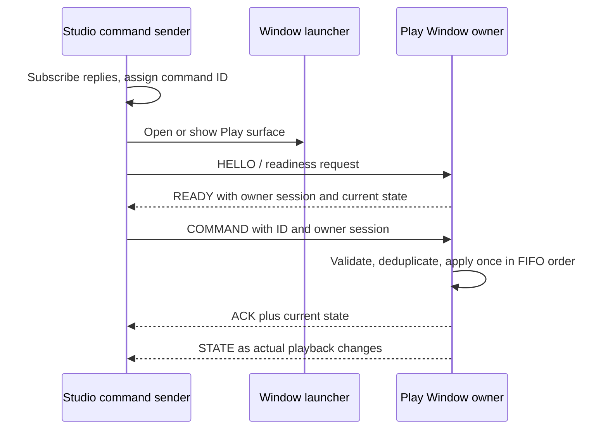

# Lalin Play command delivery — approved remediation

## Status and approval boundary

**APPROVED / IMPLEMENTED LOCALLY.** ผู้ใช้ตอบ `approve` วันที่ 2026-09-17
หลังเสนอ decision/contract/test plan นี้ การอนุมัติครอบคลุม ownership,
delivery protocol, native capabilities และการตรวจตามแผนด้านล่าง
หลักฐานและข้อจำกัดอยู่ใน [validation report](../validation/2026-09-17-LALIN-PLAY-COMMAND-DELIVERY.md)
ไม่ถือว่าการ merge PR #10 หรือผล debug fixture คือ production acceptance

Complexity: **C-3**. Risk: **HIGH** (cross-window ownership and IPC capabilities).
Baseline: `3d7b60e96fe43f2cc2564ffd13ee0e8ecb3a6446`.

## Parent and peer alignment

- `PRODUCT.md`, `DESIGN.md`: Studio เป็น creation-first; rail และ Arrange เดิมคงเดิม
- `CR-001` §5.3/6.1/14: separate surface, shared primitives, one media-state owner
- `SRS.md`: FR-16.1/4/6/8/11, FR-16W.3/6 และ FR-17.12
- `REPOSITORY_ARCHITECTURE_SOT.md`: playback อยู่ใน `apps/desktop/src/playback`
- `LALIN_UI_SOT.md`: code เป็นหลักฐาน implementation ไม่ใช่ implicit approval
- [RCA](../../.brain/rca/2026-09-17-lalin-play-command-delivery.md) ระบุ source/diagnostic evidence

ไม่แก้ Arrange engine, Mastering parameters, backend, media schema, updater,
installer, source audio หรือ Phase 2–10; ไม่เพิ่ม service/package หรือ persistent
command journal งานนี้ไม่ครอบคลุมแก้การเลือกไฟล์ preview ของ Library Pack

## Approved architecture decision

**Play Window เป็นเจ้าของ consumer playback เพียงจุดเดียว** ทั้ง queue, audio,
EQ, persistence และ media-session adapter ส่วน Studio เป็น command sender และ
แสดง snapshot จาก owner เพื่อให้ title/playing indicator ตรงกับเสียงจริง
Arrange editor playback ยังคงมี session ของตัวเองตาม CR-001 §6.1

เลิก mount prototype modal ใน Studio เมื่อใช้เส้นทาง secondary-window นี้;
ปุ่ม command bar, View menu, Play pill, FileManager และ Library ใช้ launcher เดียว
ไม่เรียก local store.play/queue mutation ก่อนส่งอีก

## Delivery contract

1. Register reply listener before opening/requesting readiness. A newly mounted
   owner announces readiness; an already-mounted owner responds to HELLO.
   Only send COMMAND after READY for the current owner session.
2. Keep commands pending in Studio memory in click order. PLAY starts playback;
   PLAY_NEXT and ADD_TO_QUEUE only update queue. Every command uses the same
   launcher/READY handshake when the owner is unavailable: open/focus Play or
   show a visible Thai failure. Queue-only actions do not autoplay.
3. Scope command IDs to a Studio session and include the owner session in each
   delivery. Owner remembers handled IDs for its lifetime and returns the prior
   acknowledgement for duplicates. StrictMode mount cycles must not duplicate actions.
4. ACK means accepted/applied command, not proof of audible output. Real loading,
   playing, paused and media errors come from owner STATE. Owner is sole writer
   of persisted consumer queue/EQ; Studio never writes stale snapshots over it.
   Verify in the real native runtime that the Play WebView can read existing
   `lalin:playback:queue` and `lalin:playback:eq` data before shipping. If storage
   is not shared, stop this slice for an explicit migration contract; do not
   overwrite, clear or silently replace existing user data with empty defaults.
5. Use an explicit finite readiness/ack timeout (initial target 5 seconds, tested
   with controlled timers). Never use a fixed sleep as evidence of readiness.
   Once a session becomes unresponsive, stop dispatching further queued commands.
6. Before dispatch, popup blocked/window error/unavailable transport is a known
   failure and is shown in Thai. After dispatch with no ACK, delivery is unknown:
   do not silently retry with a new ID or start a second local engine. When the
   same owner reconnects, reconcile the same ID; if owner session changed, show
   interrupted/unknown status and require an explicit new user action.
7. Reject malformed/wrong-version/non-target messages. Accept commands only on
   the Play surface and state replies only from the current owner session.
   This is an in-app same-origin bridge, not a new remote/network authorization system.
8. Browser popup must be created directly from the user gesture, before awaiting
   readiness. Reuse a live popup without navigating/reloading it on every click.
   Keep sender/owner channels alive only for the required lifecycle; clean up on
   teardown and failure. No claim of exactly-once delivery across process crashes.
9. Native and browser delivery must each pass their real-runtime gate. Do not
   assume Node BroadcastChannel proves WebView2 delivery or autoplay permission.
   A denied autoplay must be visible in Play with a user-operated Play action.

## Native window and permission decision

Use the existing predeclared hidden `play` window. Its close action and native
close request hide the surface while playback continues. The native close
listener must prevent destruction, await `hide()`, report failures, and be
unregistered on teardown without duplicate StrictMode listeners. Do not silently switch
to a browser popup when Tauri window operations fail. If the predeclared window
is missing unexpectedly, show an actionable restart message; dynamic native
window creation is outside this repair and needs no new create permission.

| Caller | Minimum operations to authorize |
|---|---|
| `main` | Existing permissions retained; add `core:window:allow-show`, `allow-unminimize`, `allow-set-focus` for the launcher |
| `play` | New capability matching exactly `play`: event listen/unlisten for native close handling; window hide/minimize/is-maximized/maximize/unmaximize |

All short window permission names above use the `core:window:` prefix. Play
does not inherit shell, updater, dialog, process, filesystem or arbitrary-create
permissions. Validate exact identifiers against installed ACL schemas. These
capabilities restrict the **calling window**; do not claim they are target-window
allowlists. Launcher code targets only the fixed `play` label. Keep capability
negative tests for unrelated caller labels and for missing permissions.

## Implementation slices

| Slice | Changes | Verification |
|---|---|---|
| P1 | Reproduce startup loss and duplicate local/remote play in regression tests using separate realms and real bridge behavior | Tests fail on baseline for the intended reason; no arbitrary delay assertions |
| P2 | Owner-only playback, sender ready/ack/state protocol, consistent Studio launchers and visible error handling | Cold/warm/hidden queue and single-engine integration tests pass |
| P3 | Explicit native caller capabilities; hide-on-close; no silent browser fallback for native failure | Permission-contract tests plus actual Windows Tauri window lifecycle smoke |
| P4 | Update CR/architecture/BLUEPRINT and generated graph for implemented ownership and validation evidence | Doc review, graph review, full desktop tests, root Node build and Tauri check |

Expected source scope: `windowManager.ts`, its tests, playback store/client
separation only as needed for ownership, `LalinPlayWindow.tsx`, `App.tsx`,
`FileManager.tsx`, `LibraryPanel.tsx`, and native capability files. Scope the UI
changes to existing playback controls and their error messages. Preserve user
queue/EQ data and current storage keys; no schema migration is planned.

## Acceptance matrix — results in validation report

| Case | Required result |
|---|---|
| Cold receiver, delayed React listener | One PLAY accepted after READY; exactly one owner engine starts; no Studio engine start |
| Studio module import/mount | No consumer `PlaybackAudioEngine` construction, audio graph creation or MediaSession adapter registration in Studio; Arrange engine is unaffected |
| Warm, minimized or hidden Play | Focus/show without reset; command applied once; queue and position preserved |
| Rapid PLAY / PLAY_NEXT / ADD_TO_QUEUE | FIFO acceptance, no lost/duplicated items, no autoplay for queue-only actions |
| StrictMode or duplicate command ID | One mutation; duplicate receives same acknowledgement |
| Cold restore plus new action | Persisted queue loaded by owner once; new action applied once without stale Studio overwrite |
| Existing native queue/EQ storage | Play WebView reads the existing storage keys/data; unavailable or separate storage blocks completion pending an explicit migration decision |
| Popup blocked, missing native window or unsupported bridge | Visible Thai error; no silent success and no second playback owner |
| ACK lost / owner closes or reloads | Unknown/interrupted reported honestly; no blind replay into a fresh owner |
| Native custom close, native titlebar close, minimize/restore | Same owner keeps playback while hidden/minimized; reopening retains state |
| Permission scope | main can show fixed Play via launcher; play can use its window controls; unrelated labels and plugin operations not enabled |
| Navigation and playback regression | Studio navigation does not reset consumer playback; Arrange/Mastering remain isolated |

Completion requires automated checks plus native acceptance evidence. If native
verification is unavailable, report that gate NOT_RUN and do not mark the repair
production-ready. Keep successful Node/jsdom/build results separate from audible
Windows playback, device hotplug, media keys, sleep/wake and release evidence.

## Baseline validation before implementation

- Existing targeted playback suite: **28/28 PASS** on baseline (3 files).
- Actual bridge imported by Node diagnostic: pre-listener PLAY lost, later marker
  received. Existing green tests do not cover the reproduced failure.
- `npm --workspace apps/desktop run build`: **PASS** (TypeScript + Vite), with
  the existing >500 kB chunk warning. The review worker's earlier EPERM when
  removing generated `dist/assets` did not recur in the main workspace build.
- Documentation links and `git diff --check`, including the two new documents:
  **PASS** at the proposal checkpoint. Native checks were **NOT_RUN** then.
- Luna max reviewed the candidate plan; deterministic queue launch, cross-WebView
  storage, engine construction, exact ACL identifiers and native close cleanup
  are now explicit acceptance criteria.

## Document version diff

| Document | Before | After |
|---|---|---|
| CR-001 | 0.2.2-candidate / proposed | 0.2.4b / need review; merged baseline and approved local repair, broad acceptance not completed |
| SRS | 1.3.0-draft | 1.3.1b; In Review retained, integration status corrected |
| DOCS_INDEX | 0.1.15b | 0.1.18b; RCA, approved plan, playback validation and sidecar follow-up indexed |
| RCA and this plan | Absent | 0.1.0b proposal → 0.1.1b approved implementation/evidence |

## Implementation record

`playbackBridge.ts` owns the handshake, FIFO, stable acknowledgement, deduplication
and explicit uncertain-delivery recovery. `playbackClient.ts` is the only Studio
consumer interface; `playbackOwner.ts` connects the engine/store only inside
`LalinPlayWindow`. `main.tsx` lazy-loads the selected surface. The old modal source
is retained but no longer mounted by Studio. Native permissions are split by
caller label; custom close and native close-request hide the existing Play window.

Native verification also exposed `play → waiting → playing` leaving state stuck
at loading. The existing engine now follows actual `playing` events, covered by
the RCA and regression test. This is required by delivery contract item 4.

Review follow-ups cover idle owner reload, reopening a closed popup to reconcile
an uncertain command without replay, exact prior ACK payloads and channel cleanup
when owner startup fails. No new storage schema or migration was introduced.

## CHANGELOG

| Version | Date | Status | Summary | Commit Hash | Agent |
|---|---|---|---|---|---|
| 0.1.1b | 2026-09-17 | beta | Record user approval, implemented ownership/delivery and scoped validation follow-ups | uncommitted | LALIN |
| 0.1.0b | 2026-09-17 | candidate | Propose single playback owner, delivery handshake, scoped native permissions and acceptance gates following RCA | uncommitted | LALIN |
