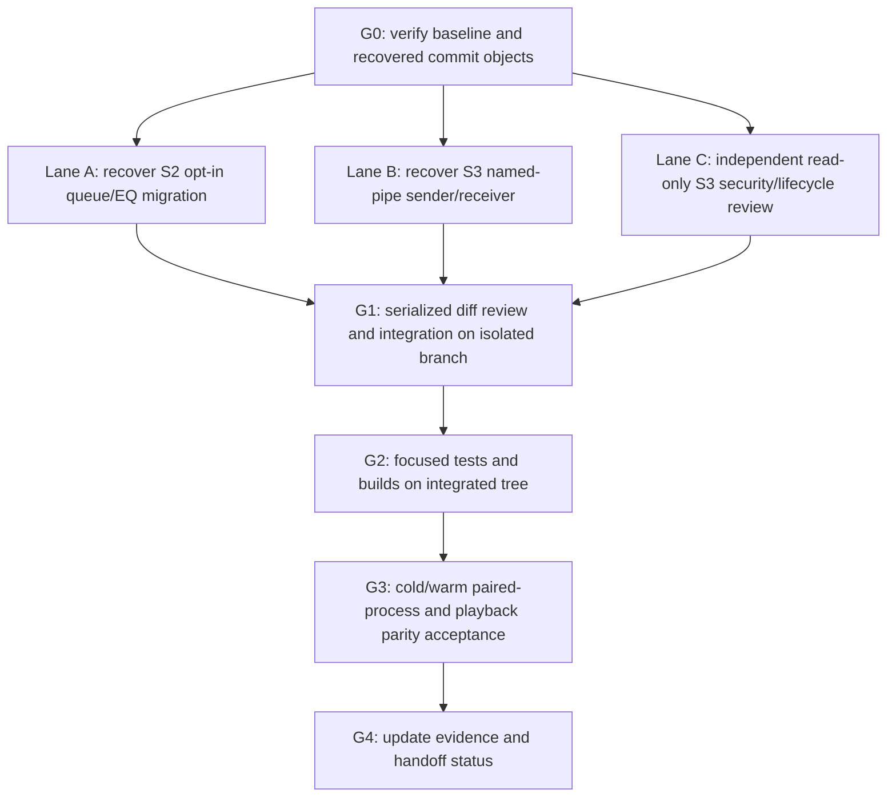

# Lalin Play S2/S3 execution DAG

## Goal, complexity and risk

Deliver the approved S2 queue/EQ migration and S3 Studio-to-Play native
named-pipe handoff from the recovered local commits, then establish lifecycle
and playback parity evidence. The Studio player route stays available until the
integrated native path passes the parity gate.

- Complexity: **C-3**, architecture-driven.
- Risk: **HIGH** — cross-process IPC, same-session authorization, local-file
  access and recovery of user playback state.
- Baseline: clean `main` at `43121cc97acb535d3b9d232d246ce54df9e3d48d`.
- Approved S2 source: `cf3c3b549bb00938ef0d21a1218891c411d06a61`.
- Approved S3 source: `b7f568819e4ccb084de75e7323b2c4877acfef66`.
- Exclude unrelated recovered WER commit `624d187da4aee92f29f47f217d6579e4d7f8e66`.

[ASSUMPTIONS]

1. The recovered commits are starting points to reconcile with current `main`,
   not proof that their old verification still passes on today's baseline.
2. S2 and S3 may edit overlapping app/docs/native files; all integration is
   serialized on a separate branch after both implementation lanes finish.
3. No branch push, PR, `main` merge, Studio route removal, Play source deletion,
   or release action is included in this execution DAG.

## Dependency graph

## Parallel work lanes

| Lane | Owner | Isolated branch/worktree | Scope and exit evidence |
|---|---|---|---|
| A — S2 migration | Implementation agent | `codex/lalin-play-s2-execution` / `runtime/worktrees/play-s2-execution` | Recover the approved S2 commit onto baseline; implement bounded schema validation, user-preview/confirmation, explicit replace semantics, transaction journal/recovery/undo and opt-in no-autoplay behavior from §§3–4 of the migration spec. Add/run focused tests. Preserve old Studio state and source files. Return a local commit and changed-file/test summary. |
| B — S3 handoff | Implementation agent | `codex/lalin-play-s3-execution` / `runtime/worktrees/play-s3-execution` | Recover only the approved S3 commit onto baseline; implement validated local-file commands, explicit same-logon-session pipe ACL and remote rejection, bounded frames, FIFO, duplicate suppression, ACK/STATE and unknown-delivery reconciliation. Add/run cold/warm lifecycle tests. Keep the Studio route enabled. Return a local commit and changed-file/test summary. |
| C — independent review | Read-only reviewer | Current baseline and recovered S3 diff | Check the proposed/implemented pipe security boundary, path validation, framing, ordering, deduplication, ACK-loss behavior, owner restart/session changes and whether lifecycle tests exercise native processes or only mocks. Return findings and unproven runtime gates; make no edits. |

Each implementation lane works only in its assigned worktree. Agents do not
push, merge into `main`, remove the Studio playback path, or claim real process
parity from mocked/unit evidence.

## Serial gates and acceptance

### G0 — source and workspace gate

- Confirm `main` baseline, clean starting tree, source commit objects and absent
  target worktree paths.
- Create both isolated worktrees from the baseline and record their heads.
- Keep the recovered WER commit out of the S3 lane.

### G1 — integration review

- Wait for A, B and C; compare each branch to the same baseline.
- Resolve overlap in a third isolated integration worktree/branch; preserve
  unrelated files and review every conflict manually.
- Verify that Arrange/Mastering preview, Cast launcher and existing Studio
  playback remain usable. Studio playback removal is prohibited at this gate.

### G2 — integrated automated evidence

- Run the focused S2 migration schema/transaction/recovery tests and S3 native
  protocol/security/lifecycle tests requested for this change.
- Run the affected Studio and standalone Play builds/tests after integration.
- Record exact commands, pass/fail counts and skipped checks. A unit test, mock,
  or build is not a real paired-process or audible-playback result.

### G3 — native parity gate

On Windows, exercise the real Studio sender and Play receiver in cold and warm
launch paths. Verify same-session authorization and remote-client rejection,
valid and invalid local paths, FIFO bursts, duplicate delivery, ACK loss followed
by query/state reconciliation, and owner restart without blind replay. Confirm
that Play/Play Next/Add to Queue retain their distinct outcomes and that valid
local media reaches the same single playback owner while Studio/API may exit.

The Studio route stays enabled unless all applicable checks pass and playback
parity is observed. If a native paired-process or audible check cannot run, mark
it **NOT_RUN**, keep Studio playback, and report the exact missing evidence.

### G4 — evidence handoff

Update the Play status/traceability documents with code SHAs, actual test
commands/results, native acceptance status, limitations and remaining S4–S7
gates. Do not describe a branch commit as an export, PR, merge or release.

## Execution status — 2026-09-26

- **G0 — complete:** baseline `43121cc97acb535d3b9d232d246ce54df9e3d48d`
  was clean. S2 recovery is based on that baseline; S3 is integrated from its
  reviewed local branch.
- **G1 — complete:** S2 (`7c30ea1`) and S3 (`235875b`) are combined on the
  isolated `codex/lalin-play-integration` branch. The independent reviewer found
  no code blocker in either lane. Documentation includes the S3 marker correction
  (`362bbd0`) and both RCA records. Nothing was pushed or merged to `main`.
- **G2 — complete on the integrated tree:** Studio Vitest 6/6, Play Vitest 23/23,
  Play Rust 31/31, Studio native handoff 6/6, API file tests 10/10; Studio and
  Play frontend builds and Rust formatting checks pass. The Rust cold/warm tests
  exercise launch decisions, not a real Studio–Play process pair.
- **G3 — NOT_RUN:** cross-session/unauthorized-client connection attempts, live FIFO pipe
  delivery, ACK-loss process interruption, mapped-drive/reparse runtime fixtures,
  Studio/API exit during active playback and audible parity have not been proven.
  Keep ordinary Studio playback available until parity is observed.
- **G4 — evidence updated locally:** integration spec, status register,
  traceability, foundation report and docs index distinguish automated checks from
  native acceptance. S2 crash/power-loss and remaining write-failure gates remain
  open. No source removal, export, PR, publication or release occurred.

## Definition of done for this execution

- S2 and S3 changes are reviewed together on an isolated integration branch.
- Requested automated lifecycle/migration checks and affected builds are
  recorded with exact outcomes.
- Native cold/warm parity either passes with evidence or remains explicitly
  **NOT_RUN** with Studio playback retained.
- Documentation separates implementation, automated checks and native runtime
  acceptance; no release or extraction gate is claimed complete prematurely.

## CHANGELOG

| Version | Date | Status | Summary | Commit Hash | Agent |
|---|---|---|---|---|---|
| 0.2.0b | 2026-09-26 | beta | Record G0-G2 completion and G3 native parity NOT_RUN status while preserving Studio playback | S2 7c30ea1; S3 235875b/362bbd0 | Codex |
| 0.1.0b | 2026-09-26 | beta | Define parallel S2/S3 implementation lanes and serial integration/parity gates | based on 43121cc | Codex |
