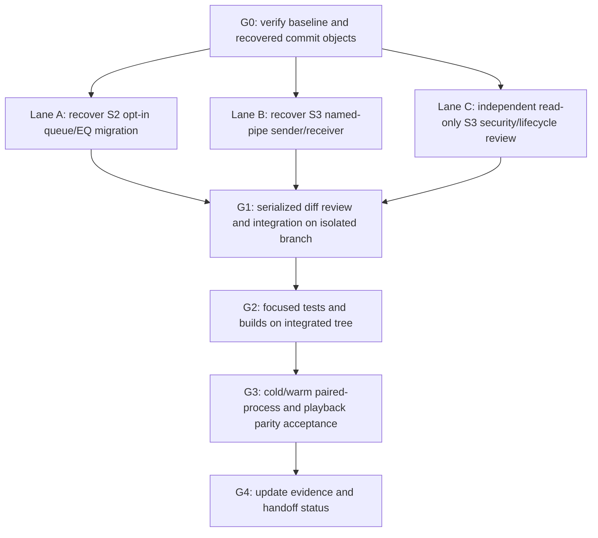

# Lalin Play S2/S3 execution DAG

## Goal, complexity and risk

Deliver the approved S2 queue/EQ migration and S3 Studio-to-Play native
named-pipe handoff from the recovered local commits, then establish lifecycle
and playback parity evidence. The Studio player route stays available until the
integrated native path passes the parity gate.

- Complexity: **C-3**, architecture-driven.
- Risk: **HIGH** — cross-process IPC, same-session authorization, local-file
  access and recovery of user playback state.
- Baseline: clean `main` at `43121cc97acb535d3b9d232d246ce54df9e3d48d`.
- Approved S2 source: `cf3c3b549bb00938ef0d21a1218891c411d06a61`.
- Approved S3 source: `b7f568819e4ccb084de75e7323b2c4877acfef66`.
- Exclude unrelated recovered WER commit `624d187da4aee92f29f47f217d6579e4d7f8e66`.

[ASSUMPTIONS]

1. The recovered commits are starting points to reconcile with current `main`,
   not proof that their old verification still passes on today's baseline.
2. S2 and S3 may edit overlapping app/docs/native files; all integration is
   serialized on a separate branch after both implementation lanes finish.
3. Scope includes opening the implementation PR and merging only after its
   review and required checks are ready. Removing the Studio route, deleting Play
   source, and releasing the app remain outside this execution.

## Dependency graph


```mermaid
flowchart TD
  G0["G0: verify baseline and recovered commit objects"]
  A["Lane A: recover S2 opt-in queue/EQ migration"]
  B["Lane B: recover S3 named-pipe sender/receiver"]
  C["Lane C: independent read-only S3 security/lifecycle review"]
  G1["G1: serialized diff review and integration on isolated branch"]
  G2["G2: focused tests and builds on integrated tree"]
  G3["G3: cold/warm paired-process and playback parity acceptance"]
  G4["G4: update evidence and handoff status"]
  G0 --> A
  G0 --> B
  G0 --> C
  A --> G1
  B --> G1
  C --> G1
  G1 --> G2 --> G3 --> G4
```

## Parallel work lanes

| Lane | Owner | Isolated branch/worktree | Scope and exit evidence |
|---|---|---|---|
| A — S2 migration | Implementation agent | `codex/lalin-play-s2-execution` / `runtime/worktrees/play-s2-execution` | Recover the approved S2 commit onto baseline; implement bounded schema validation, user-preview/confirmation, explicit replace semantics, transaction journal/recovery/undo and opt-in no-autoplay behavior from §§3–4 of the migration spec. Add/run focused tests. Preserve old Studio state and source files. Return a local commit and changed-file/test summary. |
| B — S3 handoff | Implementation agent | `codex/lalin-play-s3-execution` / `runtime/worktrees/play-s3-execution` | Recover only the approved S3 commit onto baseline; implement validated local-file commands, explicit same-logon-session pipe ACL and remote rejection, bounded frames, FIFO, duplicate suppression, ACK/STATE and unknown-delivery reconciliation. Add/run cold/warm lifecycle tests. Keep the Studio route enabled. Return a local commit and changed-file/test summary. |
| C — independent review | Read-only reviewer | Current baseline and recovered S3 diff | Check the proposed/implemented pipe security boundary, path validation, framing, ordering, deduplication, ACK-loss behavior, owner restart/session changes and whether lifecycle tests exercise native processes or only mocks. Return findings and unproven runtime gates; make no edits. |

Each implementation lane works only in its assigned worktree. Agents do not
push, merge into `main`, remove the Studio playback path, or claim real process
parity from mocked/unit evidence.

## Serial gates and acceptance

### G0 — source and workspace gate

- Confirm `main` baseline, clean starting tree, source commit objects and absent
  target worktree paths.
- Create both isolated worktrees from the baseline and record their heads.
- Keep the recovered WER commit out of the S3 lane.

### G1 — integration review

- Wait for A, B and C; compare each branch to the same baseline.
- Resolve overlap in a third isolated integration worktree/branch; preserve
  unrelated files and review every conflict manually.
- Verify that Arrange/Mastering preview, Cast launcher and existing Studio
  playback remain usable. Studio playback removal is prohibited at this gate.

### G2 — integrated automated evidence

- Run the focused S2 migration schema/transaction/recovery tests and S3 native
  protocol/security/lifecycle tests requested for this change.
- Run the affected Studio and standalone Play builds/tests after integration.
- Record exact commands, pass/fail counts and skipped checks. A unit test, mock,
  or build is not a real paired-process or audible-playback result.

### G3 — native parity gate

On Windows, exercise the real Studio sender and Play receiver in cold and warm
launch paths. Each paired-test Play process must use both an empty disposable
WebView2 profile and an isolated disposable Play app-data directory. Build that
test executable with the `g3-test-app-data-dir` feature; it must fail closed if
the override is missing. Do not use the normal `ai.lalin.play` app-data
directory.

Verify same-session authorization and remote-client rejection. For the remote
case, first prove the loopback SMB/UNC route accepts a connection to a test pipe
without remote rejection; then require the protected Play pipe to return
`ERROR_ACCESS_DENIED` on that same path while a local client still opens it.
Also verify valid and invalid local paths, FIFO bursts, duplicate delivery, ACK
loss followed by query/state reconciliation, and owner restart without blind replay. Confirm that Play/Play
Next/Add to Queue retain their distinct outcomes and that valid local media
reaches the same single playback owner while Studio/API may exit.

The Studio route stays enabled unless all applicable checks pass and playback
parity is observed. If a native paired-process or audible check cannot run, mark
it **NOT_RUN**, keep Studio playback, and report the exact missing evidence.

### G4 — evidence handoff

Update the Play status/traceability documents with code SHAs, actual test
commands/results, native acceptance status, limitations and remaining S4–S7
gates. Record export, PR, merge and release states independently.

## Execution status — 2026-09-26 (before paired-process validation)

- **G0 — complete:** baseline `43121cc97acb535d3b9d232d246ce54df9e3d48d`
  was clean. S2 recovery is based on that baseline; S3 is integrated from its
  reviewed local branch.
- **G1 — complete:** S2 (`7c30ea1`) and S3 (`235875b`) are combined on the
  isolated `codex/lalin-play-integration` branch. The independent reviewer found
  no code blocker in either lane. Documentation includes the S3 marker correction
  (`362bbd0`) and both RCA records. Nothing was pushed or merged to `main`.
- **G2 — complete on the integrated tree:** Studio Vitest 6/6, Play Vitest 23/23,
  Play Rust 31/31, Studio native handoff 6/6, API file tests 10/10; Studio and
  Play frontend builds and Rust formatting checks pass. The Rust cold/warm tests
  exercise launch decisions, not a real Studio–Play process pair.
- **G3 — NOT_RUN:** cross-session/unauthorized-client connection attempts, live FIFO pipe
  delivery, ACK-loss process interruption, mapped-drive/reparse runtime fixtures,
  Studio/API exit during active playback and audible parity have not been proven.
  Keep ordinary Studio playback available until parity is observed.
- **G4 — evidence updated locally:** integration spec, status register,
  traceability, foundation report and docs index distinguish automated checks from
  native acceptance. S2 crash/power-loss and remaining write-failure gates remain
  open. No source removal, export, PR, publication or release occurred.

## Execution status — 2026-09-27

- **G2 — complete:** `cargo test --manifest-path
  apps/play-desktop/src-tauri/Cargo.toml --offline` passed **31/31**. The Studio
  native library command `cargo test --manifest-path
  apps/desktop/src-tauri/Cargo.toml --lib` passed **6/6**, with the isolated
  paired-process test intentionally ignored in the normal run. Both Rust format
  checks passed and `cargo build --manifest-path
  apps/play-desktop/src-tauri/Cargo.toml --offline` produced the paired-test app.
- **G3 — partial; parity gate remains open:** the ignored Windows paired test
  `playback_handoff::tests::paired_windows_cold_and_warm_handoff_ack_state_and_duplicate`
  was run with `cargo test --manifest-path apps/desktop/src-tauri/Cargo.toml --lib
  playback_handoff::tests::paired_windows_cold_and_warm_handoff_ack_state_and_duplicate
  -- --ignored --exact --test-threads=1` and passed **1/1** against the freshly
  built Play app and a silent local WAV fixture.
  It verified a single cold launch, warm Play Next/Add to Queue without relaunch,
  matching ACK/STATE owner and revisions, ACK-then-disconnect reconciliation via
  QUERY_RESULT, and duplicate replay without queue/revision changes. The Play
  Windows pipe regression also passed in the 31-test suite and exercised a real
  same-logon HELLO before impersonation.
- Remaining G3 checks are not proven: unauthorized/cross-session and remote
  client rejection, concurrent FIFO bursts, owner restart, Studio/API exit during
  active playback, mapped-drive/reparse runtime cases, and audible playback
  parity. Mark G3 **PARTIAL**, not accepted; ordinary Studio playback remains
  enabled.
- **G4 — evidence updated locally:** this DAG, the Play status register and the
  [authorization-order RCA](../../.brain/rca/2026-09-26-lalin-play-handoff-impersonation-order.md),
  [canonical-path RCA](../../.brain/rca/2026-09-26-lalin-play-handoff-canonical-prefix.md)
  and [unread-reply RCA](../../.brain/rca/2026-09-27-lalin-play-handoff-unread-replies.md)
  distinguish the paired-process result from the still-open parity checks. S2
  crash/power-loss and remaining write-failure gates also remain open.

## Execution status — 2026-09-27 G3 registration follow-up

- The implementation PRs are merged on `main`; this isolated follow-up starts
  from `daa2867be389851a91bbd18fb86e896836e69975`, matching `origin/main` at
  the start of this follow-up.
- **G2 — follow-up checks:** Studio sender FIFO test passed **3/3**; Studio
  native library tests passed **6/6** with the paired-process test ignored by
  default; the expanded Rust test compiled; Play frontend build and release
  build passed. `cargo fmt --check` passed. These checks do not establish native
  pipe readiness.
- **G3 — still PARTIAL:** after adding an isolated, fail-closed app-data path,
  the expanded ignored paired test still timed out after **31.26 seconds**
  before HELLO/STATE. The test-created app-data directory appeared under system
  temp, and its process remained alive through the connect timeout. The FIFO
  burst and owner-restart checks were not reached. Isolating app data therefore
  closes the harness safety gap but does not explain the owner-readiness timeout.
- **Confirmed test-isolation gap:** the harness overrides only
  `WEBVIEW2_USER_DATA_FOLDER`. Play startup also reads and may recover files
  under Tauri `app_data_dir` (`ai.lalin.play`); Tauri resolves this through the
  Windows Known Folder API, so a fresh WebView2 profile does not isolate Play
  app data. Previous paired/manual launches may have accessed the real Play
  app-data directory; its contents were not inspected, and no mutation is
  confirmed. The harness now builds Play with the `g3-test-app-data-dir`
  feature, requires a named direct child of system temp and rejects the test
  override in a normal production build. This gap is not proven to cause the
  owner-readiness timeout.
- The test source now includes a four-command FIFO sequence with ACK revision and
  queue-order assertions plus an owner-restart case that requires
  `delivery_unknown` and blocks blind replay. Those assertions were **not
  reached** because startup did not produce a connectable owner pipe.
- **Confirmed failure boundary:** `register_handoff_owner` is the only path that
  marks the receiver ready and creates the named-pipe server. The process starts
  and remains responsive, while the paired client cannot connect; evidence does
  not isolate whether registration stops at frontend mount, the event/API
  bridge, command authorization, or native server creation. See the
  [registration readiness RCA](../../.brain/rca/2026-09-27-lalin-play-handoff-registration-readiness.md).
- Do not merge this follow-up or close G3 on the current evidence. Keep ordinary
  Studio playback enabled. Cross-session/remote rejection, invalid-path runtime
  cases, ACK-loss under process interruption, mapped-drive/reparse runtime
  cases, Studio/API exit during playback and audible parity remain unverified.

## Execution status — 2026-09-27 G3 asset-loading and paired lifecycle follow-up

- **Confirmed test-build cause for the earlier pre-HELLO reproductions:** a
  direct Cargo-built Play test executable reached native setup and library
  initialization but did not reach WebView page load, migration recovery or
  owner registration. A separate diagnostic Tauri CLI build with an absolute
  temporary `frontendDist` loaded a `file:///...` URL and reported `root=false`.
  With Tauri CLI and a relative embedded frontend directory, the isolated app
  loaded `http://tauri.localhost/`, reported `root=true`, completed migration
  recovery, created the pipe and reported `handoff_receiver_ready`. The exact
  build artifact used by every older failed attempt is not established; see the
  [registration readiness RCA](../../.brain/rca/2026-09-27-lalin-play-handoff-registration-readiness.md).
- **Paired Windows lifecycle — PASS for the tested boundary:** the ignored
  Studio test
  `playback_handoff::tests::paired_windows_cold_and_warm_handoff_ack_state_and_duplicate`
  passed **1/1** with a Tauri CLI-built Play executable using
  `g3-test-app-data-dir`, a fresh direct-child WebView2 profile and a separate
  fresh direct-child app-data directory under system temp. It verified one cold
  launch; warm Play Next and Add to Queue without relaunch; ACK/STATE owner and
  revision agreement; ACK followed by disconnect and QUERY_RESULT recovery;
  duplicate suppression; four unique-file queue additions whose order matched
  increasing ACK revisions; then owner restart, new owner state and refusal to
  replay an uncertain old-session command. Startup trace reached receiver-ready
  before both the cold and restarted owner.
- **G2 — follow-up checks:** Play Rust native tests with
  `g3-test-app-data-dir` passed **31/31**; Studio handoff tests passed **6/6**
  with the paired test ignored by default; Rust format checks passed in both
  crates. `git diff --check` is recorded after the final documentation edit.
- **FIFO test-fixture correction:** Play derives queue titles from native media
  paths, so repeated use of the same silent WAV made the original title-based
  order assertion unable to distinguish entries. The unique-file fixture was
  first built from Rust's canonical temp path (`\\?\...`), which the unchanged
  local-path validator correctly rejected. The test now copies unique WAV files
  beside the raw-path silent fixture, asserts their canonical parent is system
  temp and removes each copied file after the child exits. No production path
  validation was weakened. The paired four-command sequence is sent
  sequentially; ordering between concurrent independent Studio clients remains
  unverified.
- **G3 remains PARTIAL:** remote/cross-session rejection, invalid-path and
  mapped-drive/reparse runtime cases, ACK loss across process interruption,
  Studio/API exit during active Play playback, and audible playback parity have
  not passed. This control-plane test does not prove audio-owner parity. Keep the
  ordinary Studio playback route enabled; do not merge or remove the Studio
  owner until the full parity gate is accepted.
- **G4 — evidence updated locally:** this DAG, the Play status register,
  traceability, foundation report and registration readiness RCA now record the
  successful paired boundary, earlier test-build/fixture causes and remaining
  gates. PR #25 is still open and draft; no merge or release is claimed.

## Execution status — 2026-09-27 G3 receiver path-rejection follow-up

- **Acceptance gap and cause:** the prior paired run exercised valid local-file
  commands only. Studio and Play validator unit tests existed independently,
  but no paired test had sent an invalid path through the live Play pipe. See
  the [receiver path-rejection RCA](../../.brain/rca/2026-09-27-lalin-play-handoff-invalid-path-runtime-coverage.md).
- **Paired Windows test — PASS for this case:** the ignored
  `playback_handoff::tests::paired_windows_cold_and_warm_handoff_ack_state_and_duplicate`
  test passed **1/1**. After the owner restart, Studio sent
  `https://example.invalid/audio.wav` directly as a `COMMAND` over the
  same-logon named pipe. Play replied `ERROR` with `invalid_file_path`; a fresh
  STATE query confirmed owner, revision and the full snapshot were unchanged.
  The URL is rejected as a non-absolute Windows filesystem path before any
  filesystem/network lookup. The isolated Play executable used
  `g3-test-app-data-dir`; the silent WAV, profile and app-data paths were direct
  children of system temp, and the disposable directories were removed after
  the process exited.
- **Regression checks:** Studio native tests passed **6/6** (the paired test is
  ignored in the ordinary suite); Play native tests with
  `g3-test-app-data-dir` passed **31/31**. Rust formatting checks and
  `git diff --check` passed.
- **G3 remains PARTIAL:** this closes only receiver runtime rejection of a URL
  shaped as an invalid local path. Concurrent independent-client ordering,
  unauthorized/cross-session and remote-client rejection, mapped-drive/reparse
  runtime behavior, ACK loss across process interruption, Studio/API exit during
  active playback and audible parity remain unverified. Preserve Studio
  playback; this control-plane result does not prove audio parity.
- **G4 — evidence updated locally:** this DAG, the status register, foundation,
  traceability and new acceptance-gap RCA record the result. PR #25 remains
  open and draft; no merge or release is claimed.

## Execution status — 2026-09-27 G3 concurrent-client ordering follow-up

- **Confirmed cause:** Studio treated a busy single-instance pipe as a missing
  owner and could call its cold-launch path. Play also dropped and recreated its
  one pipe instance after each client, leaving a short interval in which a warm
  owner appeared absent. See the
  [concurrent-client RCA](../../.brain/rca/2026-09-27-lalin-play-handoff-concurrent-client-launch.md).
- **Fix:** Studio retries after `ERROR_PIPE_BUSY` and does not invoke cold launch
  after observing an existing owner. Play reuses the disconnected server pipe
  instance for the next `ConnectNamedPipe`, closing the warm-owner recreation
  gap. The wire contract and normal Studio playback route are unchanged.
- **Paired Windows G3 — PASS for concurrent ordering:** the ignored
  `playback_handoff::tests::paired_windows_cold_and_warm_handoff_ack_state_and_duplicate`
  test passed **1/1** against a Tauri CLI-built Play executable with a relative
  embedded frontend and `g3-test-app-data-dir`. It held a live connection while
  four separate Studio client states started together, required zero
  cold-launch callback calls while busy, then verified one applied ACK per
  command, unique strictly increasing ACK revisions, and final queue order
  matching ACK revision order. Existing cold/warm delivery, ACK/STATE recovery,
  duplicate suppression, owner restart without blind replay and live URL/UNC-
  shaped path rejection also passed in that paired run. Test profile, app-data
  and media
  fixtures were isolated in system temp.
- **Final source revalidation:** after the pipe-creation error path was changed
  to disconnect and release a failed instance before replacement, the Tauri
  CLI test-feature release binary was rebuilt and the same paired test passed
  again **1/1** against that binary.
- **G2 — regression:** Studio native handoff tests passed **6/6** with the
  paired test ignored in the normal suite. Play Rust tests with
  `g3-test-app-data-dir` passed **31/31**. The Tauri CLI test-feature release
  build, both Rust format checks and `git diff --check` passed.
- **G3 remains PARTIAL:** cross-session/unauthorized and remote pipe-client
  rejection, mapped-drive/reparse runtime paths (including a reparse target
  resolving to UNC), ACK loss across process interruption, Studio/API exit
  during active playback and audible parity remain unverified.
  S2 process-crash/power-loss recovery and remaining write-failure gates also
  remain open. Keep ordinary Studio playback available; do not merge or remove
  the Studio playback owner before full parity is proven.
- **G4 — evidence updated locally:** the integration spec, this DAG, status
  register, foundation, traceability and RCA record the fix and exact test
  boundary. PR #25 remains draft until the remaining acceptance gates pass.

## Execution status — 2026-09-27 G3 live UNC-shaped path rejection

The ignored paired Windows test sends both a URL-shaped path and
`\\server\share\audio.wav` as raw commands to the live same-logon Play pipe.
Each command receives `ERROR/invalid_file_path`; a fresh STATE after each
rejection has the same owner, revision and playback snapshot. The paired test
passed **1/1** after both assertions were added. The UNC-shaped value is
rejected before path resolution, so this does not exercise opening an SMB
share, a mapped network drive or a reparse target that resolves to UNC.

G3 remains **PARTIAL**. Live remote named-pipe-client rejection,
cross-session/unauthorized connection attempts, mapped-drive and reparse
runtime cases, ACK loss across process interruption, Studio/API exit during
active playback and audible parity remain unverified. Keep the Studio playback
route enabled.

## Execution status — 2026-09-27 G3 lost-ACK reconciliation

The paired test now writes an `add-to-queue` command and closes the sender pipe
without reading its ACK. Studio's reconciliation query then returns the
original applied result plus matching STATE from the still-running owner. A
same-ID retry returns the original ACK revision and does not add another queue
item. The paired Windows test passed **1/1** with this lost-ACK scenario,
alongside cold/warm, sequential and concurrent FIFO, restart and path-rejection
checks.

This verifies lost-response recovery while the Play owner remains alive. The
paired restart case below separately verifies an applied command whose sender
closed before reading ACK: after Play restarts with a new owner session, Studio
returns delivery_unknown, keeps the request uncertain, and blocks replay. Keep
ordinary Studio playback enabled.

## Execution status — 2026-09-27 G3 lost ACK across Play owner restart

The ignored paired Windows test writes an add-to-queue command, closes its
sender without reading ACK, then reads STATE from the same owner and verifies
exactly one appended queue item against the pre-command HELLO snapshot. It
terminates the isolated Play process and starts a new owner session before
reconciliation.

The old request returns delivery_unknown after restart. Studio retains the
uncertain request; retrying the same request does not launch Play, does not
replay the command, and leaves the new owner's queue unchanged. See the [restart-test RCA](../../.brain/rca/2026-09-27-lalin-play-handoff-restart-test-title-assumption.md). This verifies
the no-blind-replay boundary across a process interruption. It does not prove
durable ACK history or audible playback parity.

The paired test passed 1/1 on Windows with a local silent WAV, a disposable
WebView2 profile and test-only app-data directory under system temp. Studio
handoff tests passed 6/6 with the paired test ignored by default. Play Rust tests
passed 31/31 with g3-test-app-data-dir. Both Rust formatting checks and
git diff --check passed.

G3 remains PARTIAL: different-logon-session and remote pipe-client
rejection, mapped-drive/reparse runtime paths, Studio/API exit during active
playback and audible parity remain unverified. S2 process-crash/power-loss
recovery and remaining write-failure gates also remain open. Keep ordinary
Studio playback available.

## Earlier execution status — 2026-09-27 restricted-logon ACL negative

The Windows pipe ACL test now creates a restricted impersonation token with the
current logon SID disabled, attempts `CreateFileW` against the real local test
pipe, and verifies Windows returns `ERROR_ACCESS_DENIED`. The existing same-session
client then connects and sends HELLO successfully. This proves the protected DACL
denies a local client token that lacks the allowed logon SID; it does not exercise
a separate Windows logon session or a remote pipe client.

The focused test passed **1/1**, and the complete Play Rust suite passed **31/31**
with `g3-test-app-data-dir`. `cargo fmt -- --check` and `git diff --check` passed.
At this validation point G3 remained PARTIAL: different-logon-session and remote
pipe-client rejection, mapped-drive/reparse runtime cases, Studio/API exit during
active playback and audible parity were still open. S2 process-crash/power-loss
recovery and remaining native write-failure gates were also open. Preserve
Studio playback.

## Execution status — 2026-09-27 G3 loopback SMB denial

The ignored Play Windows test
`handoff::windows_pipe::tests::remote_named_pipe_client_is_denied_with_local_positive_control`
passed **1/1**. Its authenticated-users positive-control pipe accepted
`\\localhost\pipe\...`, proving the loopback SMB named-pipe route worked on this
host. The target used the same permissive test DACL but the production pipe mode;
it returned `ERROR_ACCESS_DENIED` for the same remote path, then accepted a
local client. This isolates the remote-rejection flag from a DACL denial. The
existing restricted-token ACL test also passed **1/1**. The full Play Rust suite
passed **35 tests, 0 failures, 2 ignored** (the opt-in SMB probe and migration
child-process driver); `cargo fmt --check` and `git diff --check` passed.

This proves `PIPE_REJECT_REMOTE_CLIENTS` denies a loopback UNC/SMB client on
this host when the pipe DACL would otherwise allow it. It does not prove
behavior from a different machine or a separately logged-on interactive user.
Mapped-drive/reparse runtime cases, Studio/API exit during active playback and
audible parity remain open. Preserve Studio playback.

## Execution status — 2026-09-27 S2 recovery and write failures

The Play native migration test launched an ignored child test driver, waited for
each durable fixture checkpoint, forcibly terminated that process, then ran the
same directory-level startup recovery used before store initialization. The five
checkpoints were Prepared, catalog written while still Prepared, Applied,
Committed and Acknowledged. Recovery restored the prior catalog for the first
three; it retained the new catalog for Committed and Acknowledged and removed
the acknowledged journal.

The focused test passed **1/1**. Three storage-failure cases also pass: failed
initial journal creation leaves no journal; failed undo-snapshot persistence
leaves the committed journal retryable; failed import-history persistence also
retains retry state and records the export ID exactly once after retry. The full
Play Rust suite passed **35 tests** with one test-only child driver ignored by
default; `cargo fmt -- --check` passed. This does not exercise a restarted
desktop binary or WebView, power loss, other untested storage writes or a live
Studio-to-Play transfer. G3's remote/session security and audible parity gates
remain open. Preserve Studio playback.

## Execution status — 2026-09-27 G3 cross-host probe preparation

Added the ignored test `handoff::windows_pipe::tests::remote_named_pipe_client_from_another_host_is_denied`
and `tools/verify/lalin-play-remote-pipe-client.ps1`. The server creates a
same-DACL remote positive-control pipe, a production-mode target pipe, and a
result pipe. The client reports the positive-control connection and target
Win32 error; the server requires `control=0;target=5` (`ERROR_ACCESS_DENIED`)
and then verifies local access to the target. The script accepts only a host
name and test nonce; it writes no files and requests no credentials.

The mapped-drive and reparse runtime tests are also present as ignored tests and
compile against the production validator, but have not run because their SMB
mapping and reparse fixtures are not provisioned. The cross-host named-pipe test
is NOT_RUN until the PowerShell client is run from the second Windows host. The
full Play Rust suite passed **35 tests, 0 failures, 5 ignored**; `cargo fmt
--check`, PowerShell parsing and embedded P/Invoke compilation plus `git diff --check` passed. The ignored tests are
the cross-host and loopback named-pipe probes, the two filesystem fixture probes,
and the migration child-process driver.

On the Play host, run:

```powershell
cargo test --offline --manifest-path apps/play-desktop/src-tauri/Cargo.toml --features g3-test-app-data-dir remote_named_pipe_client_from_another_host_is_denied -- --ignored --nocapture --test-threads=1
```

After it prints `REMOTE_PIPE_PROBE_READY host=<host> nonce=<nonce>`, run this
from the second Windows host in the same network:

```powershell
powershell -ExecutionPolicy Bypass -File tools/verify/lalin-play-remote-pipe-client.ps1 -PipeHost <host> -Nonce <nonce>
```

The test is currently NOT_RUN; this preparation does not close the remote-host
gate. Separate interactive logon session, mapped-drive/reparse runtime cases,
Studio/API exit during playback and audible parity remain open. Preserve Studio
playback.

## Definition of done for this execution

- S2 and S3 changes are reviewed together on an isolated integration branch.
- Requested automated lifecycle/migration checks and affected builds are
  recorded with exact outcomes.
- Native paired-process checks either pass with evidence or remain explicitly
  partial/NOT_RUN; keep Studio playback until full parity is proven.
- Documentation separates implementation, automated checks and native runtime
  acceptance; no release or extraction gate is claimed complete prematurely.

## CHANGELOG

| Version | Date | Status | Summary | Commit Hash | Agent |
|---|---|---|---|---|---|
| 0.2.17b | 2026-09-27 | beta | Prepare opt-in second-host named-pipe probe and record mapped/reparse runtime tests as compiled but NOT_RUN | based on 3bb4414 | Codex |
| 0.2.16b | 2026-09-27 | beta | Verify loopback SMB/UNC denial with positive controls; retain separate-session and playback gates | based on a75c540 | Codex |
| 0.2.15b | 2026-09-27 | beta | Add retryable undo-snapshot write-failure evidence alongside initial journal and history failures | based on e843e1c | Codex |
| 0.2.14b | 2026-09-27 | beta | Cover initial journal creation and retryable history-write failures with process-termination recovery; retain runtime and parity gates | based on 75c2001 | Codex |
| 0.2.13b | 2026-09-27 | beta | Verify directory-level S2 recovery after forced child-process termination at five checkpoints; retain runtime and parity gates | based on e2bd20a | Codex |
| 0.2.12b | 2026-09-27 | beta | Verify the local Windows named-pipe ACL denies a restricted client without the allowed logon SID; retain cross-session and playback gates | based on 988a3e4 | Codex |
| 0.2.11b | 2026-09-27 | beta | Verify paired lost-ACK command application before owner restart and block replay in the new session; retain playback parity gates | based on 17a5c96 | Codex |
| 0.2.10b | 2026-09-27 | beta | Add paired lost-ACK query/state reconciliation against the live owner; keep interruption and parity gates open | based on cee5e93 | Codex |
| 0.2.9b | 2026-09-27 | beta | Record paired live URL/UNC-shaped path rejection with unchanged STATE; keep remaining security/parity gates open | based on cee5e93 | Codex |
| 0.2.8b | 2026-09-27 | beta | Rebuild final Play source and rerun paired G3 lifecycle/concurrency test successfully; keep remaining parity gates open | based on 1084d5e | Codex |
| 0.2.7b | 2026-09-27 | beta | Record the busy-pipe/cold-launch fix and concurrent paired FIFO result; preserve remaining parity gates | based on 1084d5e | Codex |
| 0.2.6b | 2026-09-27 | beta | Record live receiver rejection of an invalid URL path with unchanged STATE; keep remaining parity gates open | based on b90ffaed | Codex |
| 0.2.5b | 2026-09-27 | beta | Record successful isolated cold/warm paired lifecycle, FIFO fixture fix and remaining parity gates | based on 9e0cb06 | Codex |
| 0.2.4b | 2026-09-27 | beta | Add fail-closed Play app-data isolation to G3 and record the continued pre-HELLO timeout | based on 5351a18 | Codex |
| 0.2.3b | 2026-09-27 | beta | Record the unisolated Tauri app-data boundary and gate further paired runs on a disposable test-only data path | based on 5351a18 | Codex |
| 0.2.2b | 2026-09-27 | beta | Record FIFO/restart test additions and cold owner-registration readiness failure; keep G3 partial | based on daa2867 | Codex |
| 0.2.1b | 2026-09-27 | beta | Record the real Windows cold/warm paired handoff and ACK/STATE reconciliation pass while keeping parity gates open | based on ed20af8 | Codex |
| 0.2.0b | 2026-09-26 | beta | Record G0-G2 completion and G3 native parity NOT_RUN status while preserving Studio playback | S2 7c30ea1; S3 235875b/362bbd0 | Codex |
| 0.1.0b | 2026-09-26 | beta | Define parallel S2/S3 implementation lanes and serial integration/parity gates | based on 43121cc | Codex |
