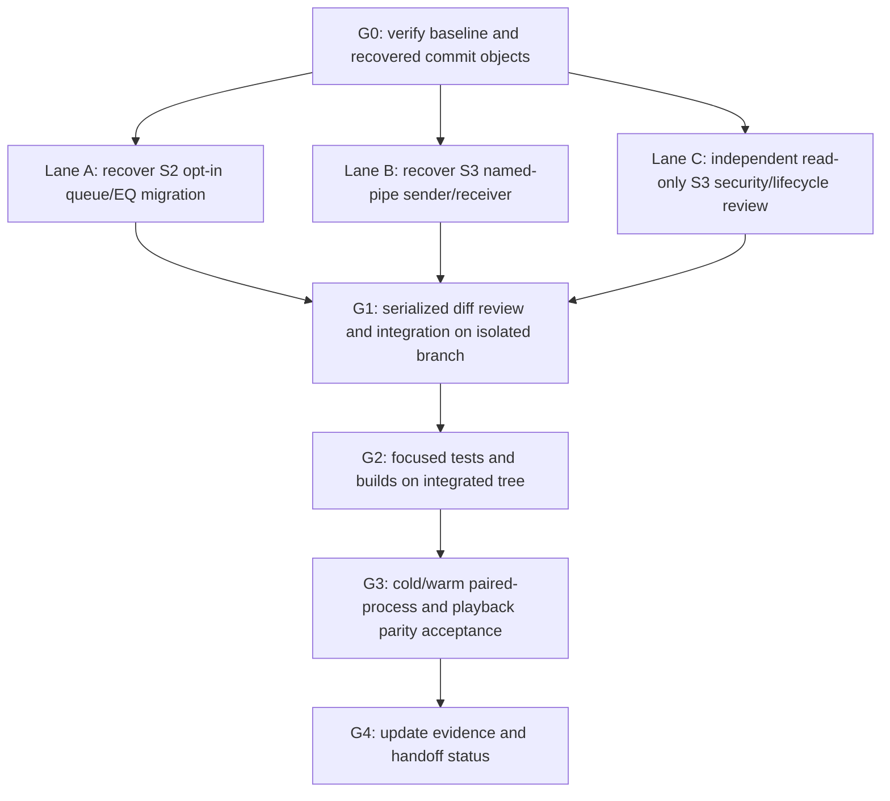

# Lalin Play S2/S3 execution DAG

## Goal, complexity and risk

Deliver the approved S2 queue/EQ migration and S3 Studio-to-Play native
named-pipe handoff from the recovered local commits, then establish lifecycle
and playback parity evidence. The Studio player route stays available until the
integrated native path passes the parity gate.

- Complexity: **C-3**, architecture-driven.
- Risk: **HIGH** — cross-process IPC, same-session authorization, local-file
  access and recovery of user playback state.
- Baseline: clean `main` at `43121cc97acb535d3b9d232d246ce54df9e3d48d`.
- Approved S2 source: `cf3c3b549bb00938ef0d21a1218891c411d06a61`.
- Approved S3 source: `b7f568819e4ccb084de75e7323b2c4877acfef66`.
- Exclude unrelated recovered WER commit `624d187da4aee92f29f47f217d6579e4d7f8e66`.

[ASSUMPTIONS]

1. The recovered commits are starting points to reconcile with current `main`,
   not proof that their old verification still passes on today's baseline.
2. S2 and S3 may edit overlapping app/docs/native files; all integration is
   serialized on a separate branch after both implementation lanes finish.
3. Scope includes opening the implementation PR and merging only after its
   review and required checks are ready. Removing the Studio route, deleting Play
   source, and releasing the app remain outside this execution.

## Dependency graph

```mermaid
flowchart TD
  G0["G0: verify baseline and recovered commit objects"]
  A["Lane A: recover S2 opt-in queue/EQ migration"]
  B["Lane B: recover S3 named-pipe sender/receiver"]
  C["Lane C: independent read-only S3 security/lifecycle review"]
  G1["G1: serialized diff review and integration on isolated branch"]
  G2["G2: focused tests and builds on integrated tree"]
  G3["G3: cold/warm paired-process and playback parity acceptance"]
  G4["G4: update evidence and handoff status"]
  G0 --> A
  G0 --> B
  G0 --> C
  A --> G1
  B --> G1
  C --> G1
  G1 --> G2 --> G3 --> G4
```

## Parallel work lanes

| Lane | Owner | Isolated branch/worktree | Scope and exit evidence |
|---|---|---|---|
| A — S2 migration | Implementation agent | `codex/lalin-play-s2-execution` / `runtime/worktrees/play-s2-execution` | Recover the approved S2 commit onto baseline; implement bounded schema validation, user-preview/confirmation, explicit replace semantics, transaction journal/recovery/undo and opt-in no-autoplay behavior from §§3–4 of the migration spec. Add/run focused tests. Preserve old Studio state and source files. Return a local commit and changed-file/test summary. |
| B — S3 handoff | Implementation agent | `codex/lalin-play-s3-execution` / `runtime/worktrees/play-s3-execution` | Recover only the approved S3 commit onto baseline; implement validated local-file commands, explicit same-logon-session pipe ACL and remote rejection, bounded frames, FIFO, duplicate suppression, ACK/STATE and unknown-delivery reconciliation. Add/run cold/warm lifecycle tests. Keep the Studio route enabled. Return a local commit and changed-file/test summary. |
| C — independent review | Read-only reviewer | Current baseline and recovered S3 diff | Check the proposed/implemented pipe security boundary, path validation, framing, ordering, deduplication, ACK-loss behavior, owner restart/session changes and whether lifecycle tests exercise native processes or only mocks. Return findings and unproven runtime gates; make no edits. |

Each implementation lane works only in its assigned worktree. Agents do not
push, merge into `main`, remove the Studio playback path, or claim real process
parity from mocked/unit evidence.

## Serial gates and acceptance

### G0 — source and workspace gate

- Confirm `main` baseline, clean starting tree, source commit objects and absent
  target worktree paths.
- Create both isolated worktrees from the baseline and record their heads.
- Keep the recovered WER commit out of the S3 lane.

### G1 — integration review

- Wait for A, B and C; compare each branch to the same baseline.
- Resolve overlap in a third isolated integration worktree/branch; preserve
  unrelated files and review every conflict manually.
- Verify that Arrange/Mastering preview, Cast launcher and existing Studio
  playback remain usable. Studio playback removal is prohibited at this gate.

### G2 — integrated automated evidence

- Run the focused S2 migration schema/transaction/recovery tests and S3 native
  protocol/security/lifecycle tests requested for this change.
- Run the affected Studio and standalone Play builds/tests after integration.
- Record exact commands, pass/fail counts and skipped checks. A unit test, mock,
  or build is not a real paired-process or audible-playback result.

### G3 — native parity gate

On Windows, exercise the real Studio sender and Play receiver in cold and warm
launch paths. Each paired-test Play process must use both an empty disposable
WebView2 profile and an isolated disposable Play app-data directory. Build that
test executable with the `g3-test-app-data-dir` feature; it must fail closed if
the override is missing. Do not use the normal `ai.lalin.play` app-data
directory.

Verify same-session authorization and remote-client rejection, valid and invalid
local paths, FIFO bursts, duplicate delivery, ACK loss followed by query/state
reconciliation, and owner restart without blind replay. Confirm that Play/Play
Next/Add to Queue retain their distinct outcomes and that valid local media
reaches the same single playback owner while Studio/API may exit.

The Studio route stays enabled unless all applicable checks pass and playback
parity is observed. If a native paired-process or audible check cannot run, mark
it **NOT_RUN**, keep Studio playback, and report the exact missing evidence.

### G4 — evidence handoff

Update the Play status/traceability documents with code SHAs, actual test
commands/results, native acceptance status, limitations and remaining S4–S7
gates. Record export, PR, merge and release states independently.

## Execution status — 2026-09-26 (before paired-process validation)

- **G0 — complete:** baseline `43121cc97acb535d3b9d232d246ce54df9e3d48d`
  was clean. S2 recovery is based on that baseline; S3 is integrated from its
  reviewed local branch.
- **G1 — complete:** S2 (`7c30ea1`) and S3 (`235875b`) are combined on the
  isolated `codex/lalin-play-integration` branch. The independent reviewer found
  no code blocker in either lane. Documentation includes the S3 marker correction
  (`362bbd0`) and both RCA records. Nothing was pushed or merged to `main`.
- **G2 — complete on the integrated tree:** Studio Vitest 6/6, Play Vitest 23/23,
  Play Rust 31/31, Studio native handoff 6/6, API file tests 10/10; Studio and
  Play frontend builds and Rust formatting checks pass. The Rust cold/warm tests
  exercise launch decisions, not a real Studio–Play process pair.
- **G3 — NOT_RUN:** cross-session/unauthorized-client connection attempts, live FIFO pipe
  delivery, ACK-loss process interruption, mapped-drive/reparse runtime fixtures,
  Studio/API exit during active playback and audible parity have not been proven.
  Keep ordinary Studio playback available until parity is observed.
- **G4 — evidence updated locally:** integration spec, status register,
  traceability, foundation report and docs index distinguish automated checks from
  native acceptance. S2 crash/power-loss and remaining write-failure gates remain
  open. No source removal, export, PR, publication or release occurred.

## Execution status — 2026-09-27

- **G2 — complete:** `cargo test --manifest-path
  apps/play-desktop/src-tauri/Cargo.toml --offline` passed **31/31**. The Studio
  native library command `cargo test --manifest-path
  apps/desktop/src-tauri/Cargo.toml --lib` passed **6/6**, with the isolated
  paired-process test intentionally ignored in the normal run. Both Rust format
  checks passed and `cargo build --manifest-path
  apps/play-desktop/src-tauri/Cargo.toml --offline` produced the paired-test app.
- **G3 — partial; parity gate remains open:** the ignored Windows paired test
  `playback_handoff::tests::paired_windows_cold_and_warm_handoff_ack_state_and_duplicate`
  was run with `cargo test --manifest-path apps/desktop/src-tauri/Cargo.toml --lib
  playback_handoff::tests::paired_windows_cold_and_warm_handoff_ack_state_and_duplicate
  -- --ignored --exact --test-threads=1` and passed **1/1** against the freshly
  built Play app and a silent local WAV fixture.
  It verified a single cold launch, warm Play Next/Add to Queue without relaunch,
  matching ACK/STATE owner and revisions, ACK-then-disconnect reconciliation via
  QUERY_RESULT, and duplicate replay without queue/revision changes. The Play
  Windows pipe regression also passed in the 31-test suite and exercised a real
  same-logon HELLO before impersonation.
- Remaining G3 checks are not proven: unauthorized/cross-session and remote
  client rejection, concurrent FIFO bursts, owner restart, Studio/API exit during
  active playback, mapped-drive/reparse runtime cases, and audible playback
  parity. Mark G3 **PARTIAL**, not accepted; ordinary Studio playback remains
  enabled.
- **G4 — evidence updated locally:** this DAG, the Play status register and the
  [authorization-order RCA](../../.brain/rca/2026-09-26-lalin-play-handoff-impersonation-order.md),
  [canonical-path RCA](../../.brain/rca/2026-09-26-lalin-play-handoff-canonical-prefix.md)
  and [unread-reply RCA](../../.brain/rca/2026-09-27-lalin-play-handoff-unread-replies.md)
  distinguish the paired-process result from the still-open parity checks. S2
  crash/power-loss and remaining write-failure gates also remain open.

## Execution status — 2026-09-27 G3 registration follow-up

- The implementation PRs are merged on `main`; this isolated follow-up starts
  from `daa2867be389851a91bbd18fb86e896836e69975`, matching `origin/main` at
  the start of this follow-up.
- **G2 — follow-up checks:** Studio sender FIFO test passed **3/3**; Studio
  native library tests passed **6/6** with the paired-process test ignored by
  default; the expanded Rust test compiled; Play frontend build and release
  build passed. `cargo fmt --check` passed. These checks do not establish native
  pipe readiness.
- **G3 — still PARTIAL:** after adding an isolated, fail-closed app-data path,
  the expanded ignored paired test still timed out after **31.26 seconds**
  before HELLO/STATE. The test-created app-data directory appeared under system
  temp, and its process remained alive through the connect timeout. The FIFO
  burst and owner-restart checks were not reached. Isolating app data therefore
  closes the harness safety gap but does not explain the owner-readiness timeout.
- **Confirmed test-isolation gap:** the harness overrides only
  `WEBVIEW2_USER_DATA_FOLDER`. Play startup also reads and may recover files
  under Tauri `app_data_dir` (`ai.lalin.play`); Tauri resolves this through the
  Windows Known Folder API, so a fresh WebView2 profile does not isolate Play
  app data. Previous paired/manual launches may have accessed the real Play
  app-data directory; its contents were not inspected, and no mutation is
  confirmed. The harness now builds Play with the `g3-test-app-data-dir`
  feature, requires a named direct child of system temp and rejects the test
  override in a normal production build. This gap is not proven to cause the
  owner-readiness timeout.
- The test source now includes a four-command FIFO sequence with ACK revision and
  queue-order assertions plus an owner-restart case that requires
  `delivery_unknown` and blocks blind replay. Those assertions were **not
  reached** because startup did not produce a connectable owner pipe.
- **Confirmed failure boundary:** `register_handoff_owner` is the only path that
  marks the receiver ready and creates the named-pipe server. The process starts
  and remains responsive, while the paired client cannot connect; evidence does
  not isolate whether registration stops at frontend mount, the event/API
  bridge, command authorization, or native server creation. See the
  [registration readiness RCA](../../.brain/rca/2026-09-27-lalin-play-handoff-registration-readiness.md).
- Do not merge this follow-up or close G3 on the current evidence. Keep ordinary
  Studio playback enabled. Cross-session/remote rejection, invalid-path runtime
  cases, ACK-loss under process interruption, mapped-drive/reparse runtime
  cases, Studio/API exit during playback and audible parity remain unverified.

## Execution status — 2026-09-27 G3 asset-loading and paired lifecycle follow-up

- **Confirmed test-build cause for the earlier pre-HELLO reproductions:** a
  direct Cargo-built Play test executable reached native setup and library
  initialization but did not reach WebView page load, migration recovery or
  owner registration. A separate diagnostic Tauri CLI build with an absolute
  temporary `frontendDist` loaded a `file:///...` URL and reported `root=false`.
  With Tauri CLI and a relative embedded frontend directory, the isolated app
  loaded `http://tauri.localhost/`, reported `root=true`, completed migration
  recovery, created the pipe and reported `handoff_receiver_ready`. The exact
  build artifact used by every older failed attempt is not established; see the
  [registration readiness RCA](../../.brain/rca/2026-09-27-lalin-play-handoff-registration-readiness.md).
- **Paired Windows lifecycle — PASS for the tested boundary:** the ignored
  Studio test
  `playback_handoff::tests::paired_windows_cold_and_warm_handoff_ack_state_and_duplicate`
  passed **1/1** with a Tauri CLI-built Play executable using
  `g3-test-app-data-dir`, a fresh direct-child WebView2 profile and a separate
  fresh direct-child app-data directory under system temp. It verified one cold
  launch; warm Play Next and Add to Queue without relaunch; ACK/STATE owner and
  revision agreement; ACK followed by disconnect and QUERY_RESULT recovery;
  duplicate suppression; four unique-file queue additions whose order matched
  increasing ACK revisions; then owner restart, new owner state and refusal to
  replay an uncertain old-session command. Startup trace reached receiver-ready
  before both the cold and restarted owner.
- **G2 — follow-up checks:** Play Rust native tests with
  `g3-test-app-data-dir` passed **31/31**; Studio handoff tests passed **6/6**
  with the paired test ignored by default; Rust format checks passed in both
  crates. `git diff --check` is recorded after the final documentation edit.
- **FIFO test-fixture correction:** Play derives queue titles from native media
  paths, so repeated use of the same silent WAV made the original title-based
  order assertion unable to distinguish entries. The unique-file fixture was
  first built from Rust's canonical temp path (`\\?\...`), which the unchanged
  local-path validator correctly rejected. The test now copies unique WAV files
  beside the raw-path silent fixture, asserts their canonical parent is system
  temp and removes each copied file after the child exits. No production path
  validation was weakened. The paired four-command sequence is sent
  sequentially; ordering between concurrent independent Studio clients remains
  unverified.
- **G3 remains PARTIAL:** remote/cross-session rejection, invalid-path and
  mapped-drive/reparse runtime cases, ACK loss across process interruption,
  Studio/API exit during active Play playback, and audible playback parity have
  not passed. This control-plane test does not prove audio-owner parity. Keep the
  ordinary Studio playback route enabled; do not merge or remove the Studio
  owner until the full parity gate is accepted.
- **G4 — evidence updated locally:** this DAG, the Play status register,
  traceability, foundation report and registration readiness RCA now record the
  successful paired boundary, earlier test-build/fixture causes and remaining
  gates. PR #25 is still open and draft; no merge or release is claimed.

## Definition of done for this execution

- S2 and S3 changes are reviewed together on an isolated integration branch.
- Requested automated lifecycle/migration checks and affected builds are
  recorded with exact outcomes.
- Native paired-process checks either pass with evidence or remain explicitly
  partial/NOT_RUN; keep Studio playback until full parity is proven.
- Documentation separates implementation, automated checks and native runtime
  acceptance; no release or extraction gate is claimed complete prematurely.

## CHANGELOG

| Version | Date | Status | Summary | Commit Hash | Agent |
|---|---|---|---|---|---|
| 0.2.5b | 2026-09-27 | beta | Record successful isolated cold/warm paired lifecycle, FIFO fixture fix and remaining parity gates | based on 9e0cb06 | Codex |
| 0.2.4b | 2026-09-27 | beta | Add fail-closed Play app-data isolation to G3 and record the continued pre-HELLO timeout | based on 5351a18 | Codex |
| 0.2.3b | 2026-09-27 | beta | Record the unisolated Tauri app-data boundary and gate further paired runs on a disposable test-only data path | based on 5351a18 | Codex |
| 0.2.2b | 2026-09-27 | beta | Record FIFO/restart test additions and cold owner-registration readiness failure; keep G3 partial | based on daa2867 | Codex |
| 0.2.1b | 2026-09-27 | beta | Record the real Windows cold/warm paired handoff and ACK/STATE reconciliation pass while keeping parity gates open | based on ed20af8 | Codex |
| 0.2.0b | 2026-09-26 | beta | Record G0-G2 completion and G3 native parity NOT_RUN status while preserving Studio playback | S2 7c30ea1; S3 235875b/362bbd0 | Codex |
| 0.1.0b | 2026-09-26 | beta | Define parallel S2/S3 implementation lanes and serial integration/parity gates | based on 43121cc | Codex |
