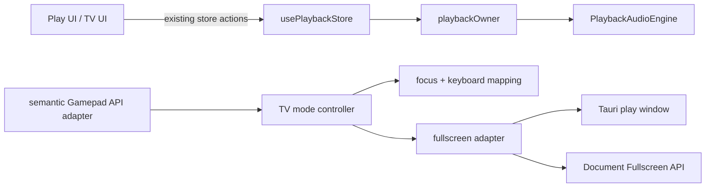

# Lalin Play TV Mode — Architecture Plan

## Status and approval boundary

**APPROVED FOR LOCAL IMPLEMENTATION.** ผู้ใช้ตอบ `approve` วันที่ 2026-09-18
หลังตรวจ parent/peer docs และ proposal ของ CR-002 การอนุมัตินี้ครอบคลุมเฉพาะ
TV Mode บน existing Play surface ตามข้อ 6 ของ CR-002

Complexity: **C-3**. Risk: **HIGH**. Baseline: `839bb9e` (local branch).

## Parent and peer constraints

- `CR-001` / `SRS FR-16..17`: Play owns consumer playback and state.
- `LALIN_PLAY_COMMAND_DELIVERY_PLAN`: Studio sends commands; Play is the only
  consumer playback owner and the predeclared label is `play`.
- `REPOSITORY_ARCHITECTURE_SOT`: `apps/desktop/src/playback` owns playback
  adapters; `LalinPlayWindow` is the only active consumer surface.
- `LALIN_SITEMAP_SOT` / `LALIN_LAYOUT_SOT`: TV is a deep Play surface, not a
  Studio rail or a second editor layout.

## Decision

Keep one React/Tauri Play window and add a session-local `tvMode` presentation
state. The state controls view, focus and fullscreen only; it never owns media,
queue or EQ. The existing `usePlaybackStore` remains the only playback writer.



## Module boundaries

| Module | Responsibility | Must not do |
|---|---|---|
| `components/LalinPlayWindow.tsx` | toggle TV view, render controls, expose accessible root and exit action | construct another audio engine or mutate persistence directly |
| `playback/tvMode.ts` | pure focus order, keyboard-to-action and semantic gamepad mapping; lifecycle cleanup | call backend or own playback state |
| `playback/windowManager.ts` | `isCurrentPlayWindowFullscreen`, `setCurrentPlayWindowFullscreen` and browser/native dispatch | target a non-`play` native window or silently fallback |
| `src-tauri/capabilities/play.json` | authorize only fullscreen inspection/change for caller `play` | inherit `core:default`, shell, process, dialog or filesystem permissions |
| `styles.css` | TV spacing, typography, target sizes and focus ring | alter normal Studio shell or Arrange layout |

The fullscreen adapter returns the actual state after a successful operation.
Browser requests are made from the user gesture; native operations use the
current Tauri window and fail with the existing actionable Thai window error.

## Fullscreen contract

```ts
isCurrentPlayWindowFullscreen(): Promise<boolean>
setCurrentPlayWindowFullscreen(fullscreen: boolean): Promise<boolean>
```

- Browser: use `document.fullscreenElement`, `requestFullscreen()` and
  `document.exitFullscreen()` when the API exists.
- Native: use Tauri `isFullscreen()` / `setFullscreen()` on label `play` only.
- If the browser API is absent, retain TV presentation in the current window and
  report `fullscreenUnavailable`; do not claim fullscreen.
- `fullscreenchange` updates local state so OS/browser exits cannot leave a stale
  TV indicator.

## Input contract

`tvMode.ts` exposes a small semantic adapter:

```ts
type TvAction = "up" | "down" | "left" | "right" | "confirm" | "back" | "menu";
type TvInputTarget = { onAction(action: TvAction): void };
```

Keyboard mapping is deterministic: Arrow keys → directions, Enter/Space →
confirm, Escape → back, `Tab` follows the browser focus order. The Gamepad API
adapter maps D-pad and buttons 0/1/9 to the same actions, polls only while TV
Mode is active, and cancels its animation frame on cleanup. No network remote is
introduced.

## Native permission delta

Add exactly these caller permissions to `play`:

- `core:window:allow-is-fullscreen`
- `core:window:allow-set-fullscreen`

Update the exact ACL contract test against `apps/desktop/src-tauri/gen/schemas`.
No main permission, dynamic window creation, backend capability or network
authorization changes are part of this plan.

## State and lifecycle invariants

1. `tvMode` defaults to `false` on every Play mount and is not persisted.
2. Entering/exiting TV Mode never calls `play`, `stop`, `clearQueue`, `resetEQ`
   or a media reload.
3. A fullscreen rejection leaves the view usable and shows an error; it does not
   set a false fullscreen state.
4. Escape exits TV Mode first. A second Escape follows the existing Play close
   behavior only when the mode is already off.
5. Gamepad polling and `fullscreenchange` listeners are removed on teardown.
6. Existing native close handling and owner connection remain unchanged.

## Verification plan

| Gate | Evidence |
|---|---|
| Unit | pure input mapping/focus tests; windowManager native/browser fullscreen tests |
| Desktop suite | existing player tests plus TV rendering/lifecycle tests |
| Browser smoke | enter/exit TV, focus/keyboard, fullscreen mock, preserved queue/EQ/owner |
| Native smoke | Tauri WebView2 fullscreen state, Escape/restore and existing hide/close lifecycle |
| Architecture/docs | `npm run check:all`, `git diff --check`, doc graph scan and review of changed contracts |
| Physical controller | `NOT_RUN` unless a real gamepad is attached; mocked semantic adapter does not count as hardware evidence |

## Implementation slices

| Slice | Change | Exit check |
|---|---|---|
| P1 | document CR/SRS/design/architecture and permission delta | links and contract names resolve |
| P2 | fullscreen adapter + ACL + pure input adapter | unit tests and exact permission test pass |
| P3 | TV rendering, focus and lifecycle wiring | component tests and browser smoke pass |
| P4 | native/browser evidence and validation report | full checks pass; limitations recorded |

## CHANGELOG

| Version | Date | Status | Summary | Commit Hash | Agent |
|---|---|---|---|---|---|
| 0.1.1b | 2026-09-18 | beta | Closed provenance for the approved C-3 architecture implemented in the local feature commit. | c86ddc4 | LALIN |
| 0.1.0b | 2026-09-18 | beta | Approved C-3 architecture for one-owner TV presentation, fullscreen and input adapters | uncommitted | LALIN |
