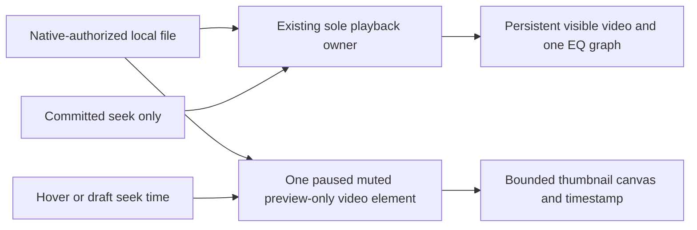
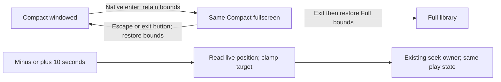

# CR-004 — Minimal Compact และภาพเฟรมระหว่างเลื่อนเวลา

## Request and approval boundary

ผู้ใช้ขอ Compact ที่เรียบง่ายที่สุด ไม่มีปุ่มคิว/EQ ใช้ layout อ้างอิง Netflix
และมีภาพเฟรมเมื่อเลื่อน playhead ผู้ใช้ตอบ `approve` อนุมัติ CR-004 เมื่อ
2026-09-20 ก่อนเริ่ม implementation; acceptance ยังต้องตรวจแยกจาก approval

Classification: **C-3 — Architecture-driven; MEDIUM risk** เพราะ preview ต้อง
ถอดเฟรมแยกโดยไม่ seek หรือสร้าง playback owner ซ้อนกับตัวเล่นจริง

[ASSUMPTIONS]

1. เปลี่ยนเฉพาะ Compact ของ standalone `apps/play-desktop`; Full คง library,
   queue, EQ และ transport เดิม ไม่ใช่การลบความสามารถเหล่านี้ออกจากโปรดัค
2. Netflix เป็นแนวทางจัดวางภาพและ controls เท่านั้น ไม่เชื่อมบริการ/บัญชี/DRM
3. ใช้ native title bar เดิมสำหรับย้าย/ย่อ/ปิดหน้าต่าง; ไม่ทำ frameless window
4. ภาพ preview ใช้กับวิดีโอที่ runtime เปิดได้เท่านั้น; audio-only ไม่มีภาพเฟรม

## Evidence and parent/peer impact

- Parent: [PRD §4.9](PRD.md#49-lalin-play--standalone-local-media-player-approved)
  และ [ADR-004](../architecture/ADR-004-LALIN-PLAY-REPOSITORY-SPLIT.md)
  กำหนดหนึ่ง owner และคง queue/position/output/EQ ระหว่าง Full/Compact
- Peer: [CR-003](CR-003--LALIN_PLAY_LOCAL_VIDEO.md) ใช้ media element เดียว
  สำหรับ playback และ stage; ข้อยกเว้น preview-only ด้านล่างได้รับ approval แล้ว
- `apps/play-desktop/src/components/Transport.tsx` ปัจจุบันมีปุ่มเต็มชุด
  และ range `onChange` เรียก `store.seek` โดยตรง ไม่มี hover/draft frame preview
- [Sitemap](../design/LALIN_SITEMAP_SOT.md) เดิมให้ Compact เข้าถึง queue/EQ
  โดยตรง; CR นี้เสนอแทนที่เฉพาะ navigation นั้น ไม่ลบ state หรือ Full controls
- Native video minimum 440x520 เดิมแก้พื้นที่ภาพถูกแถบ UI เบียด
  ([RCA](../../.brain/rca/2026-09-20-lalin-play-compact-video-height.md));
  overlay ใหม่จะไม่ใช้แถบซ้อนกันแบบเดิม จึงต้องทดสอบขนาดเล็กใหม่

## Proposed Compact layout

```text
┌──────────── native window title bar ────────────┐
│                                                │
│               VIDEO / letterbox                │
│                                                │
│                  ┌─ real frame ─┐              │
│                  │    12:34     │              │
│ ────────────────●────────────────────────────── │
│ ▶  12:00 / 45:00      🔊 volume        ↗ Full   │
└──────────── controls on gradient ───────────────┘
```

- ภาพใช้พื้นที่ client ทั้งหมด รักษาสัดส่วน `contain`; ไม่ crop/stretch
- ไม่มี app header, video heading, queue/EQ tabs, sidebar, debug PLAYING label
  หรือแถบ metadata ซ้ำใน Compact video
- เหลือ seek, Play/Pause, elapsed/duration, mute/volume และกลับ Full เท่านั้น
  ไม่มีปุ่ม Stop/Previous/Next/Shuffle/Repeat ใน Compact; queue เดินต่อเองตามเดิม
- Controls ซ้อนด้านล่างบน gradient; ซ่อนเมื่อ playing และไม่มี interaction
  2.5 วินาที แสดงเมื่อ pointer ขยับ/touch/keyboard focus; คงแสดงเมื่อ paused,
  ended, idle, error, ลาก seek หรือ focus อยู่บน controls
- Pointer ออกจากพื้นที่ไม่ทำให้ tooltip ค้าง; controls ที่ซ่อนต้องไม่เป็น
  invisible click targets และ keyboard focus ต้องทำให้ controls ปรากฏทันที
- Audio-only แสดงปกที่มีจริงหรือ neutral icon กับชื่อ และ controls ชุดเล็กเดิม
  โดยไม่ auto-hide; empty state มีปุ่มเปิดไฟล์เมื่อยังไม่มีสื่อ
- เปิดไฟล์อื่นผ่าน Full หรือ drag/drop ที่มีอยู่ ไม่เพิ่มปุ่มถาวรใน video overlay
- เสนอ Compact minimum 440x300 logical pixels ทั้ง audio/video และ default
  500x340; คง Full bounds เดิม ตรวจ native DPI/controls/tooltip ก่อนรับขนาดนี้

## Scrub interaction contract

1. Hover timeline แสดงเฟรมของตำแหน่งที่ชี้พร้อมเวลา โดยไม่ seek ตัวเล่นหลัก
2. Pointer down/drag แสดง draft playhead/time/frame; playing หรือ paused เดิม
   คงอยู่จนปล่อย ไม่เขียนตำแหน่งเล่นทุก pointer move
3. Pointer release commit seek หนึ่งครั้งไปตำแหน่งสุดท้าย; pointer cancel หรือ
   Escape ยกเลิก draft โดยไม่ seek และไม่เปลี่ยนสถานะเล่นเดิม
4. Keyboard seek ใช้ range semantics และชื่อภาษาไทย; commit การปรับของ keyboard
   โดยไม่ต้องรอ pointer release และไม่ทำให้ keyboard-only ใช้งานไม่ได้
5. Thumbnail อยู่ภายในหน้าต่าง รวมต้น/ท้าย timeline; loading ต้องแสดงตรงตามจริง
   decode ไม่ได้ให้แสดงเวลาและข้อความ preview ไม่พร้อม ไม่ใช้ภาพตำแหน่งอื่นแทน
6. Audio/unknown duration/ไม่มีไฟล์ ไม่ร้องขอ video frame; duration ไม่พร้อมให้
   disabled seek ชั่วคราว ไม่สร้าง NaN/Infinity seek

## Proposed ownership and resource boundary



- Playback element, source, Web Audio graph, queue, EQ และ MediaSession ยังมี
  owner เดิมชุดเดียว ไม่ remount/reload เมื่อสลับ layout
- อนุญาต auxiliary HTMLVideoElement สูงสุดหนึ่งตัวเฉพาะ preview: muted,
  paused, ไม่เรียก `play()`, ไม่ต่อ Web Audio/MediaSession และไม่ publish
  playback events เข้า store เป็นข้อยกเว้นเฉพาะจำนวน media elements ของ CR-003
  ไม่ใช่ข้อยกเว้นให้สร้าง playback engine ตัวที่สอง
- ใช้ URL จาก native catalog authorization เดิม ไม่รับ arbitrary path/remote
  URL และไม่ขยาย asset scope; ไม่เพิ่ม ffmpeg, sidecar หรือ decoder dependency
- Decode แบบ seek-only แล้วคัดเฟรมลง canvas หลังเฟรมพร้อม; จำกัดหนึ่งงานที่กำลัง
  decode และหนึ่ง latest pending request ทิ้งผล stale ด้วย source/request generation
- Thumbnail กว้างไม่เกิน 192 pixels รักษาสัดส่วนและสูงไม่เกิน 108 pixels;
  cache ในหน่วยความจำสูงสุด 24 ภาพต่อ current source ไม่มี disk cache
- ยกเลิก/ล้าง pending, cache, listeners และ preview source เมื่อเปลี่ยนสื่อ,
  ออกจาก Compact หรือ unmount; decode error ไม่เปลี่ยน nowPlaying หรือ queue
- WebView2 ต้องพิสูจน์การ seek/decode และ canvas บน authorized asset URL จริง
  หากข้อจำกัด runtime ทำไม่ได้ ให้รายงาน blocker ไม่เพิ่ม native decoder เงียบ ๆ

## Acceptance / success / exit criteria

| ID | Required proof |
|---|---|
| PLAY-C01 | Compact video screenshot ไม่มี queue/EQ/header/ปุ่มรอง ภาพไม่ถูกบีบ; Full ยังมี controls เดิม |
| PLAY-C02 | Controls auto-hide/reveal ถูกต้อง พร้อม paused/error/focus/drag exceptions; mouse/touch/keyboard ใช้งานได้ |
| PLAY-C03 | Hover และ rapid drag แสดงเฟรมจริงจาก MP4/WebM fixtures ที่มี frame timestamp; ไม่ใช่ภาพ live playback |
| PLAY-C04 | Hover ไม่เปลี่ยน main currentTime/source/play state; drag commit หนึ่งครั้งและ cancel ไม่ seek |
| PLAY-C05 | เฟรมใหม่สุดชนะ source switch/rapid seek; ไม่มีภาพไฟล์ก่อนหน้า ไม่มี preview audio/owner/graph ซ้อน |
| PLAY-C06 | เล่นต่อ Full ↔ Compact โดย queue/EQ/output/position คงเดิม; audio-only, empty, decode-error และ silent video ไม่ถดถอย |
| PLAY-C07 | Native minimum/default size และ DPI 100%/150% controls ไม่ล้น tooltip ต้น/ท้ายไม่ออกนอก viewport |
| PLAY-C08 | Tests/build ผ่าน; Windows screenshots พร้อม observable time/continuity และบันทึกข้อจำกัด CPU/memory/codec ตามจริง |

Implementation sequence after approval:

1. Minimal Compact layout + visibility → test controls/keyboard/native sizing.
2. Isolated frame preview + draft seek → test ownership/cancellation/bounded work.
3. Native MP4/WebM/audio regression + screenshots → update verification report.

Implemented locally: 40 frontend / 6 Rust tests, native MP4/WebM preview,
paused hover/seek, auto-hide, minimum viewport และ audio-only ตรวจผ่าน ดู
[รายงานและข้อจำกัด](../validation/LALIN_PLAY_MINIMAL_COMPACT.md)
DPI 150%, touch, performance profiling และ physical audio ยังไม่ตรวจ;
หลักฐาน CR-003 ไม่ใช่หลักฐานของ preview
ไม่รวม Studio removal, repository publication, commit/push, installer/release,
new codecs, subtitle, streaming, PiP หรือ OS fullscreen ในขอบเขตนี้

## Addendum A — Fullscreen และ ±10 วินาที (approved)

ผู้ใช้ขอ `add full screen mode` และ `add +10 sec,-10 sec` หลัง minimal Compact
ตรวจ native แล้ว ผู้ใช้ตอบ `approve` อนุมัติ addendum นี้เมื่อ 2026-09-20
ก่อนเริ่มโค้ด; verification ยังต้องตรวจแยก Complexity **C-3**, risk **MEDIUM**:
เกี่ยวข้องกับ native window state, layout และ playback interaction

[ASSUMPTIONS]

1. เพิ่มปุ่มใน **Compact** ตามบริบทงานนี้ ทั้ง audio/video; Full library เดิม
   และปุ่มขยายภาพภายในหน้าต่างยังไม่เปลี่ยนความหมาย
2. Fullscreen คือเต็มจอ Windows จริง ไม่ใช่ maximize และไม่ใช่กลับ Full
3. ไม่เพิ่ม global hotkeys, PiP, TV/gamepad behavior หรือหน้าต่างตัวเล่นอีกตัว

### UI and behavior

```text
────────────────── seek / frame preview ──────────────────
↶10   ▶/Ⅱ   10↷   elapsed / duration   🔊 volume   ⛶   ↗ Full
```

- ปุ่ม `ย้อน 10 วินาที` และ `ข้าม 10 วินาที` อยู่ข้าง Play/Pause พร้อมชื่อไทย
  สำหรับ accessibility; ไม่ใช้ Previous/Next แทน และยังไม่มีคิว/EQ ใน Compact
- กดแล้ว seek จาก **ตำแหน่งเล่นจริงล่าสุด** ไม่ใช่ตำแหน่ง hover/draft; clamp
  ให้อยู่ในช่วง seekable ของไฟล์ ไม่ติดลบและไม่เกิน duration
- คง playing/paused, queue, volume และ EQ; กดข้ามเมื่อใกล้จบต้องไม่สั่ง next
  หรือ trigger queue advance เพราะ seek ไป endpoint ให้ clamp ก่อน endpoint
  เล็กน้อยเมื่อจำเป็น แล้วให้ natural playback จบตามพฤติกรรมเดิม
- Disable ±10 เมื่อไม่มีสื่อ, duration ไม่พร้อม, loading/error หรือกำลังลาก
  timeline เพื่อไม่ให้คำสั่งปุ่มแข่งกับ draft seek; hover อย่างเดียวไม่ block
- ปุ่ม `เต็มจอ` / `ออกจากเต็มจอ` เป็น toggle แยกจาก `กลับ Full` ใช้หน้าต่าง
  เดิมและภาพ `contain`; native title bar/taskbar ไม่กินพื้นที่ใน fullscreen
- Fullscreen คง Compact overlay, preview และ auto-hide เดิม ไม่เปิด TV mode
- กด Escape ออกจาก fullscreen และคืนตำแหน่ง/ขนาด/สถานะ maximized ก่อนเข้า
  ถ้ากำลังลาก seek ให้ Escape ครั้งแรก cancel draft; ครั้งถัดไปจึงออก fullscreen
- กด `กลับ Full` ขณะ fullscreen ให้ออกจาก fullscreen แล้วคืน Full bounds
  เดิม ไม่บันทึกขนาดจอ fullscreen ทับ Compact/Full remembered bounds
- ปุ่มไม่ optimistic-toggle ก่อน native สำเร็จ; ระหว่าง transition disable
  ปุ่มซ้ำ และเมื่อ error แสดงเหตุผล/อ่านสถานะจริงเพื่อให้ UI ไม่ค้างผิดโหมด
- หน้าต่างขั้นต่ำ 440x300 ยังต้องใช้ controls ได้ครบ อาจลด spacing/ความกว้าง
  volume slider เฉพาะ Compact โดยไม่เพิ่มเมนูหรือบดบัง preview

### Parent/peer and implementation boundary

Parent PRD §4.9/ADR-004 ยังมีสอง surface และหนึ่ง playback owner ไม่เปลี่ยน
source, graph หรือ asset scope. Addendum นี้แทนข้อยกเว้น OS fullscreen ใน
out-of-scope เดิมเฉพาะ Compact และเพิ่มสามปุ่มจาก minimal controls ที่อนุมัติไว้

Evidence: `src-tauri/src/lib.rs` มี `set_tv` ที่เรียก native `set_fullscreen`
แต่ UI ผูกกับ TV และ `set_surface` ปัจจุบันเก็บ bounds ตอนเปลี่ยน surface
จึงต้องแยกการคืน windowed bounds จาก fullscreen snapshot อย่างชัดเจน
ใช้ native state/คำสั่ง fullscreen ที่ scoped เฉพาะ main window; ไม่เปิด
general-purpose window permissions ให้ frontend และไม่เปลี่ยน TV navigation



### Acceptance and exit criteria

| ID | Required proof |
|---|---|
| PLAY-C09 | Native screenshot fullscreen without title bar; exit returns original Compact size/position; media time continues without reload |
| PLAY-C10 | Fullscreen → Full → Compact restores both windowed bounds; native failure/repeated-click handling does not desynchronize UI or TV state |
| PLAY-C11 | ±10 works in playing and paused; start/end/unknown-duration cases clamp/disable correctly; no implicit next-track or duplicate playback |
| PLAY-C12 | Escape cancels drag before exiting fullscreen; hover preview remains isolated; keyboard focus and compact controls fit 440x300 |
| PLAY-C13 | Relevant frontend/Rust tests and native build pass; MP4/WebM/audio screenshots/results recorded separately from unrun DPI/device checks |

Execution after approval: native fullscreen/restore contract → Compact buttons
and bounded relative seek → tests/native screenshots → update evidence report.
Implemented locally after approval: 48 frontend / 7 Rust tests and native build
pass. Windows captures cover paused ±10, end clamping, normal/maximized bounds
restoration, Fullscreen → Full → Compact, playing WebM and isolated fullscreen
preview. See [Addendum A evidence and limits](../validation/LALIN_PLAY_FULLSCREEN_SKIP.md).
DPI 150%, touch, multi-monitor and physical audio remain unverified; native
failure injection and Escape-during-drag are automated-test evidence only.
No commit/push/release included; prior C01–08 captures remain historical evidence.

## CHANGELOG

| Version | Date | Status | Summary | Commit Hash | Agent |
|---|---|---|---|---|---|
| 0.2.1b | 2026-09-20 | beta | Record explicit approval, fullscreen/ten-second implementation and bounded local verification | based on 8429010 | LALIN |
| 0.2.0b | 2026-09-20 | candidate | Propose Compact native fullscreen and bounded plus/minus ten-second controls; await approval | based on 8429010 | LALIN |
| 0.1.1b | 2026-09-20 | beta | Record explicit approval, local implementation and bounded native verification | based on 8429010 | LALIN |
| 0.1.0b | 2026-09-20 | candidate | Propose minimal Compact overlay and isolated local frame previews; await approval | based on 8429010 | LALIN |
